---
## Front matter
lang: ru-RU
title: Структура научной презентации
subtitle: Простейший шаблон
author:
  - Прокопьева М. Е.
institute:
  - Российский университет дружбы народов, Москва, Россия
date: 28 февраля, 2024, Москва, Россия

## i18n babel
babel-lang: russian
babel-otherlangs: english

## Formatting pdf
toc: false
toc-title: Содержание
slide_level: 2
aspectratio: 169
section-titles: true
theme: metropolis
header-includes:
 - \metroset{progressbar=frametitle,sectionpage=progressbar,numbering=fraction}
 - '\makeatletter'
 - '\beamer@ignorenonframefalse'
 - '\makeatother'
---

# Информация

## Докладчик

:::::::::::::: {.columns align=center}
::: {.column width="70%"}

  * Прокопьева Марина Евгеньевна 
  * студент
  * 1132237370
  * Российский университет дружбы народов

:::
::: {.column width="30%"}

:::
::::::::::::::
# Вводная часть

## Цели и задачи

- Изучить идеологию и применение средств контроля версий.
  Освоить умения по работе с git.
  
-   Создать базовую конфигурацию для работы с git.
    Создать ключ SSH.
    Создать ключ PGP.
    Настроить подписи git.
    Зарегистрироваться на Github.
    Создать локальный каталог для выполнения заданий по предмету.

# Выполнение лабораторной работы

*Зададим имя и email владельца репозитория:*

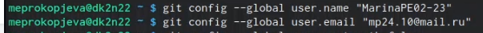{#fig:001 width=70%}

*Зададим имя начальной ветки (будем называть её master), Параметр autocrlf, Параметр safecrlf:*

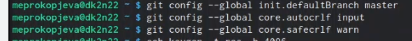{#fig:002 width=70%}

*Создаю ключи ssh*

по алгоритму rsa с ключём размером 4096 бит:

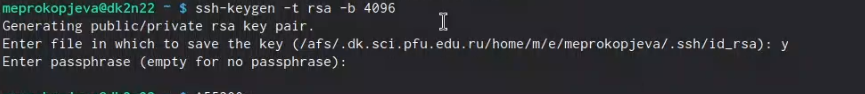{#fig:003 width=70%}

по алгоритму ed25519:

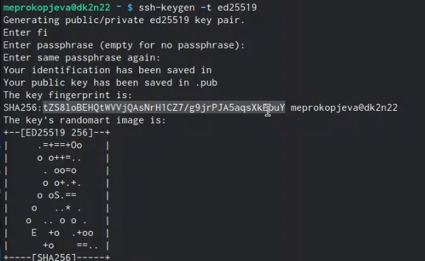{#fig:004 width=70%}

*Создаю ключи pgp*

Генерируем ключ

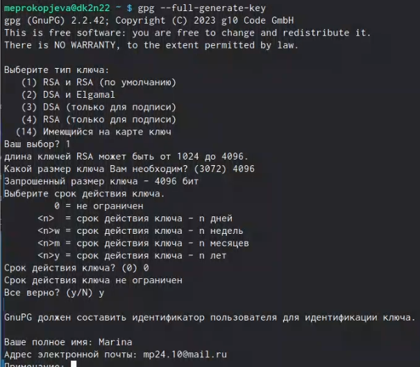{#fig:005 width=70%}

## Из предложенных опций выбираем:

    тип RSA and RSA;
    размер 4096;
    выберала срок действия; значение по умолчанию — 0 (срок действия не истекает никогда).

GPG запросит личную информацию, которая сохранится в ключе:

    Имя (не менее 5 символов).
    Адрес электронной почты.
    При вводе email убедилась, что он соответствует адресу, используемому на GitHub.
    Комментарий. 
    
## Добавление PGP ключа в GitHub

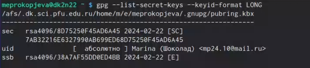{#fig:006 width=70%}

Cкопируйте ваш сгенерированный PGP ключ в буфер обмена:

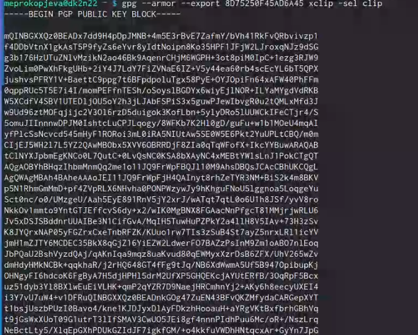{#fig:007 width=70%}

*Настройка автоматических подписей коммитов git*

{#fig:008 width=70%}

## Настройка gh

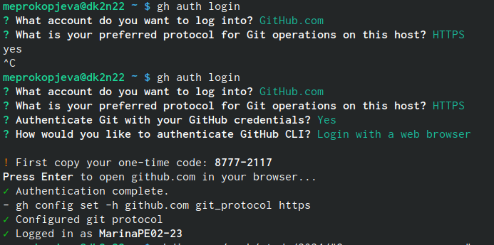{#fig:009 width=70%}

*Сознание репозитория курса на основе шаблона*

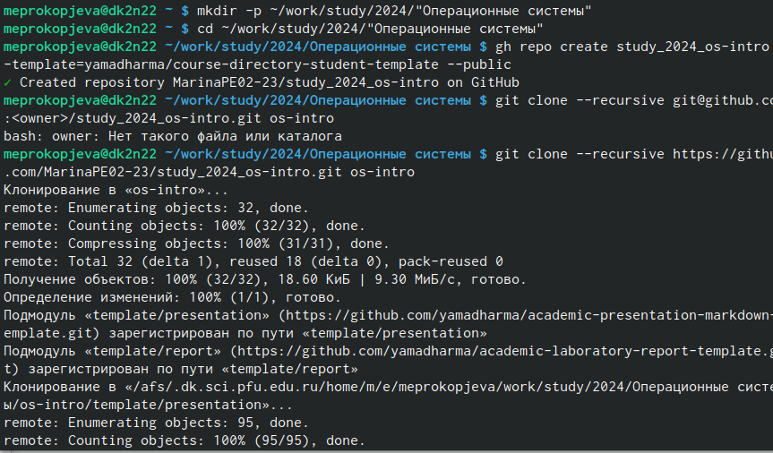{#fig:010 width=70%}

*Настройка каталога курса*

Перешла в каталог курса:
 
 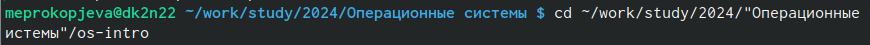{#fig:011 width=70%}
 
## Удалить лишние файлы:
 
 {#fig:012 width=70%}
 
 Создала необходимые каталоги:
 
 {#fig:013 width=70%}
 
 
 {#fig:014 width=70%}

## Отправила файлы на сервер

 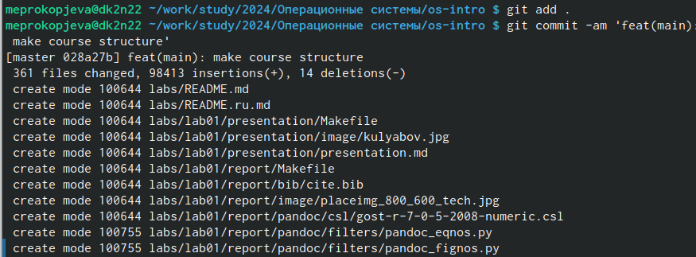{#fig:015 width=70%}
 
 
 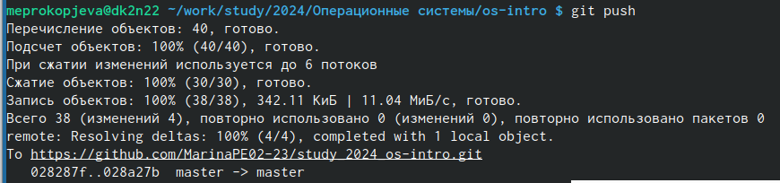{#fig:016 width=70%}
 
# Выводы

Изучили идеологию и применение средств контрося вериский и освоили умения по работе с git. 

