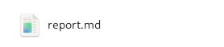
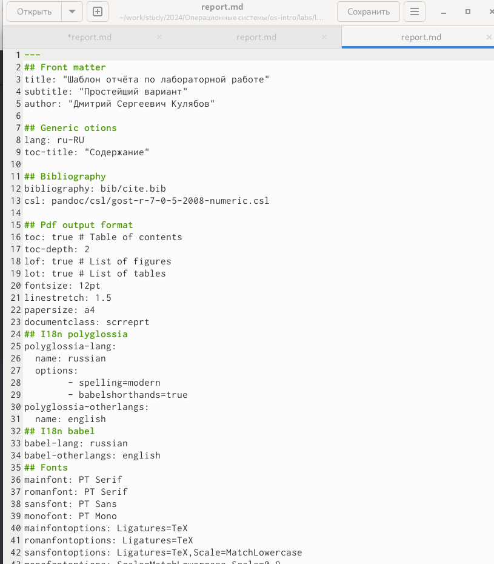
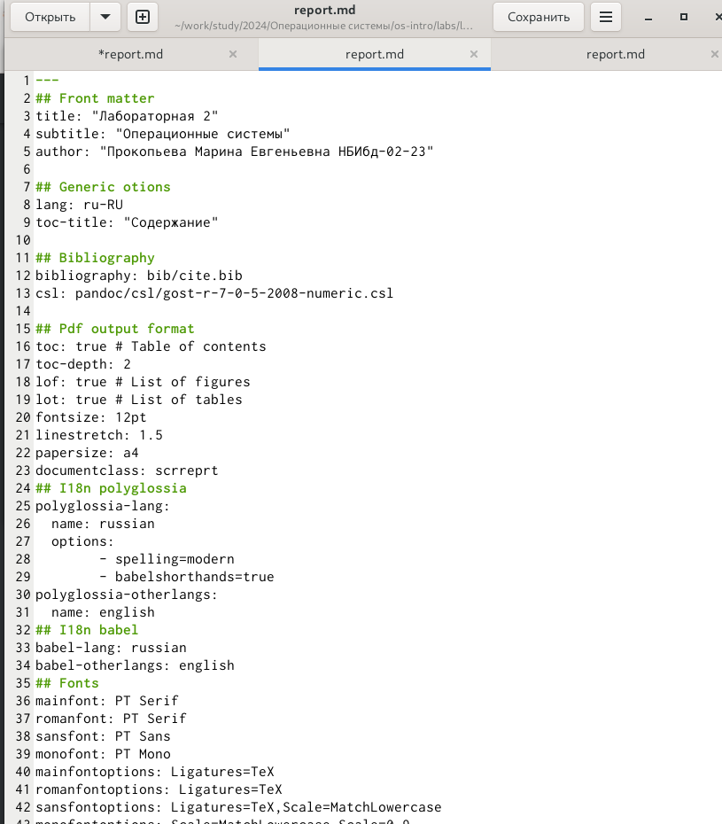
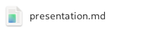
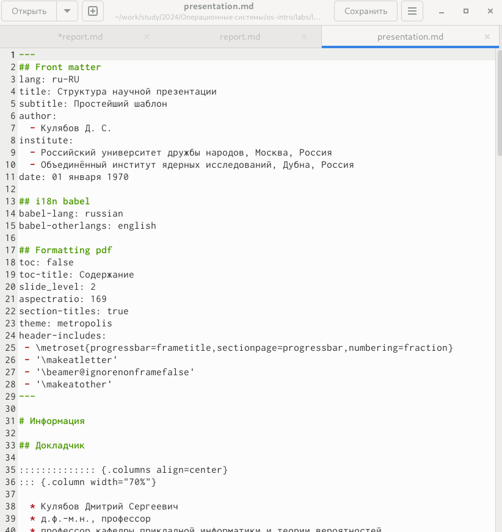
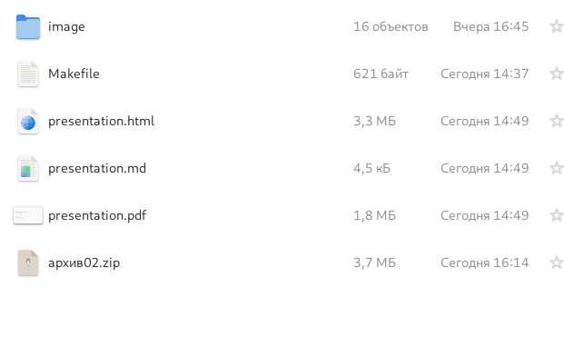

---
## Front matter
lang: ru-RU
title: Лабораторная работа 3
author:
  - Прокопьева М.Е.
institute:
  - Российский университет дружбы народов, Москва, Россия
date: 29 февраля 2024

## i18n babel
babel-lang: russian
babel-otherlangs: english

## Formatting pdf
toc: false
toc-title: Содержание
slide_level: 2
aspectratio: 169
section-titles: true
theme: metropolis
header-includes:
 - \metroset{progressbar=frametitle,sectionpage=progressbar,numbering=fraction}
 - '\makeatletter'
 - '\beamer@ignorenonframefalse'
 - '\makeatother'
---

# Информация

## Докладчик

:::::::::::::: {.columns align=center}
::: {.column width="70%"}

  * Прокопьева Марина Евгеньевна
  * студент
  * 1132237370
  * Российский университет дружбы народов

:::
::: {.column width="30%"}

:::
::::::::::::::

# Вводная часть

## Цели и задачи

Научиться оформлять отчёты с помощью легковесного языка разметки Markdown.

## Задание

Сделайте отчёт по предыдущей лабораторной работе в формате Markdown.
– В качестве отчёта просьба предоставить отчёты в 3 форматах: pdf, docx и md (в архиве, поскольку он должен содержать скриншоты, Makefile и т.д.)

# Выполнение лабораторной 

## Заходим в файл report.md в соответсвующей папке 

{#fig:001 width=70%}

Изучаем шаблон 

{#fig:002 width=70%}

## Оформляем отчет по шаблону 

{#fig:003 width=70%}

## Заходим в файл presentation.md в соответсвующей папке 

{#fig:004 width=70%}

Изучаем шаблон создания презентации 

{#fig:005 width=70%}

## Оформляем отчет по шаблону

{#fig:006 width=70%}

## Запускаем команду make в папках report и presentation тем самым создавая файлы в pdf, html, docx

{#fig:007 width=70%}

{#fig:008 width=70%}

## Вывод

Научилась оформлять отчет с помощью легковесного языка разметки Markdown.

