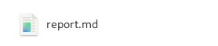
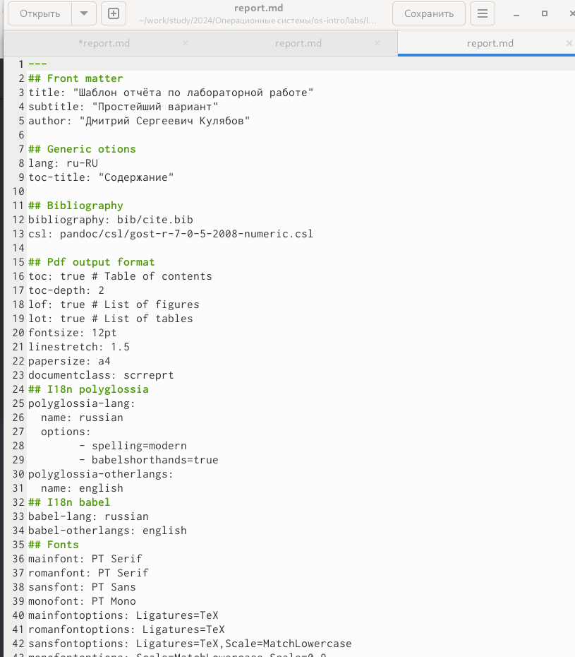
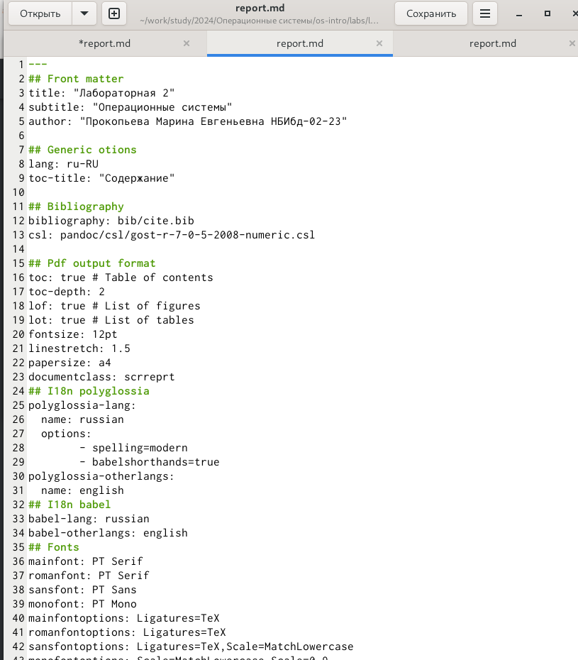
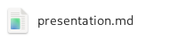
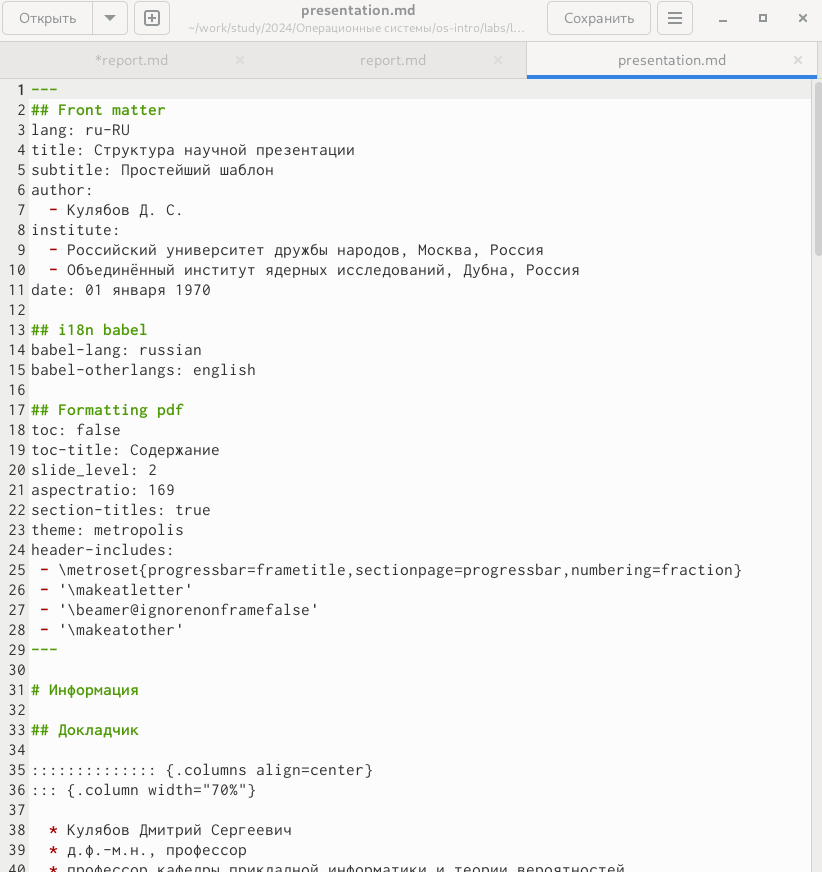
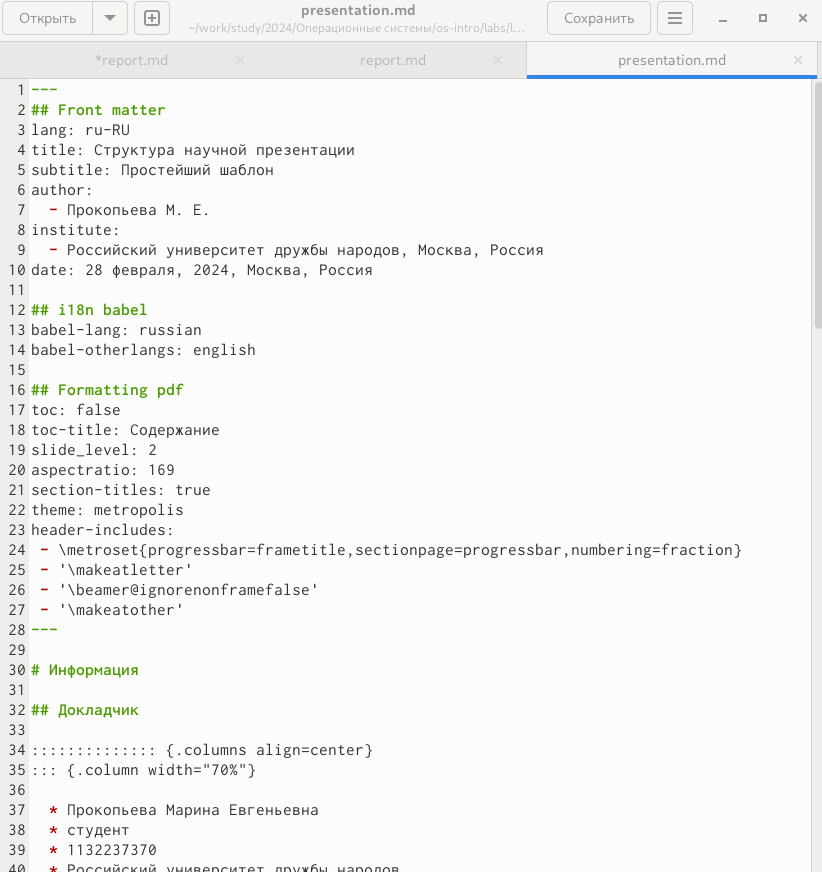
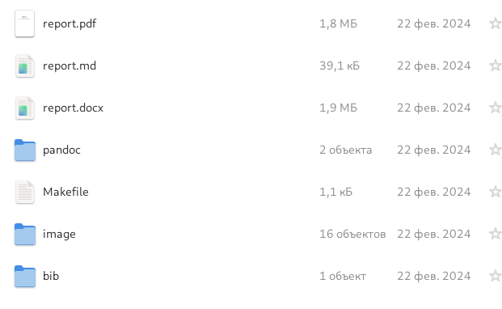
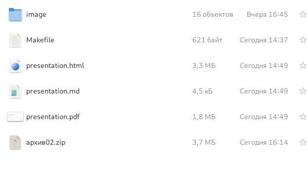

---
## Front matter

title: "Лабораторная 3"
author: "Прокопьева Марина Евгеньевна"

## Generic otions

lang: ru-RU
toc-title: "Содержание"

## Bibliography

bibliography: bib/cite.bib
csl: pandoc/csl/gost-r-7-0-5-2008-numeric.csl

## Pdf output format

toc: true # Table of contents
toc-depth: 2
lof: true # List of figures
lot: true # List of tables
fontsize: 12pt
linestretch: 1.5
papersize: a4
documentclass: scrreprt

## I18n polyglossia

polyglossia-lang:
  name: russian
  options:
	- spelling=modern
	- babelshorthands=true
polyglossia-otherlangs:
  name: english
  
## I18n babel

babel-lang: russian
babel-otherlangs: english

## Fonts

mainfont: PT Serif
romanfont: PT Serif
sansfont: PT Sans
monofont: PT Mono
mainfontoptions: Ligatures=TeX
romanfontoptions: Ligatures=TeX
sansfontoptions: Ligatures=TeX,Scale=MatchLowercase
monofontoptions: Scale=MatchLowercase,Scale=0.9

## Biblatex

biblatex: true
biblio-style: "gost-numeric"
biblatexoptions:
  - parentracker=true
  - backend=biber
  - hyperref=auto
  - language=auto
  - autolang=other*
  - citestyle=gost-numeric
  
## Pandoc-crossref LaTeX customization

figureTitle: "Рис."
tableTitle: "Таблица"
listingTitle: "Листинг"
lofTitle: "Список иллюстраций"
lotTitle: "Список таблиц"
lolTitle: "Листинги"

## Misc options

indent: true
header-includes:
  - \usepackage{indentfirst}
  - \usepackage{float} # keep figures where there are in the text
  - \floatplacement{figure}{H} # keep figures where there are in the text
  
---

# Цель работы

Научиться оформлять отчёты с помощью легковесного языка разметки Markdown.

# Задание

Сделайте отчёт по предыдущей лабораторной работе в формате Markdown.
– В качестве отчёта просьба предоставить отчёты в 3 форматах: pdf, docx и md (в архиве, поскольку он должен содержать скриншоты, Makefile и т.д.)

# Выполнение лабораторной работы

Заходим в файл report.md в соответсвующей папке 

{#fig:001 width=70%}

Изучаем шаблон 

{#fig:002 width=70%}

Оформляем отчет по шаблону 

{#fig:003 width=70%}

Заходим в файл presentation.md в соответсвующей папке 

{#fig:004 width=70%}

Изучаем шаблон создания презентации 

{#fig:005 width=70%}

Оформляем отчет по шаблону

{#fig:006 width=70%}

Запускаем команду make в папках report и presentation тем самым создавая файлы в pdf, html, docx

{#fig:007 width=70%}

{#fig:008 width=70%}

# Выводы

Научилась оформлять отчет с помощью легковесного языка разметки Markdown.

