---
## Front matter
lang: ru-RU
title: Структура научной презентации
subtitle: Простейший шаблон
author:
  - Прокопьева М. Е.
institute:
  - Российский университет дружбы народов, Москва, Россия
date: 14.03.2024

## i18n babel
babel-lang: russian
babel-otherlangs: english

## Formatting pdf
toc: false
toc-title: Содержание
slide_level: 2
aspectratio: 169
section-titles: true
theme: metropolis
header-includes:
 - \metroset{progressbar=frametitle,sectionpage=progressbar,numbering=fraction}
 - '\makeatletter'
 - '\beamer@ignorenonframefalse'
 - '\makeatother'
---

# Информация

## Докладчик

  * Прокопьева Марина Евгеньевна
  * Студент
  * 1132237370
  * Российский университет дружбы народов

# Вводная часть

# Цель работы

Приобретение практических навыков взаимодействия пользователя с системой по-
средством командной строки.

# Задание

1. Определите полное имя вашего домашнего каталога. Далее относительно этого ката-
лога будут выполняться последующие упражнения.
2. Выполните следующие действия:
2.1. Перейдите в каталог /tmp.
2.2. Выведите на экран содержимое каталога /tmp. Для этого используйте команду ls
с различными опциями. Поясните разницу в выводимой на экран информации.
2.3. Определите, есть ли в каталоге /var/spool подкаталог с именем cron?
2.4. Перейдите в Ваш домашний каталог и выведите на экран его содержимое. Опре-
делите, кто является владельцем файлов и подкаталогов?
3. Выполните следующие действия:
3.1. В домашнем каталоге создайте новый каталог с именем newdir.
3.2. В каталоге ~/newdir создайте новый каталог с именем morefun.
3.3. В домашнем каталоге создайте одной командой три новых каталога с именами
letters, memos, misk. Затем удалите эти каталоги одной командой.
3.4. Попробуйте удалить ранее созданный каталог ~/newdir командой rm. Проверьте,
был ли каталог удалён.
3.5. Удалите каталог ~/newdir/morefun из домашнего каталога. Проверьте, был ли
каталог удалён.
4. С помощью команды man определите, какую опцию команды ls нужно использо-
вать для просмотра содержимое не только указанного каталога, но и подкаталогов,
входящих в него.
5. С помощью команды man определите набор опций команды ls, позволяющий отсорти-
ровать по времени последнего изменения выводимый список содержимого каталога
с развёрнутым описанием файлов.
6. Используйте команду man для просмотра описания следующих команд: cd, pwd, mkdir,
rmdir, rm. Поясните основные опции этих команд.
7. Используя информацию, полученную при помощи команды history, выполните мо-
дификацию и исполнение нескольких команд из буфера команд.

# Выполнение лабораторной работы

Определили полное имя домашнего каталога и поперемещались между папками с помощью команд.

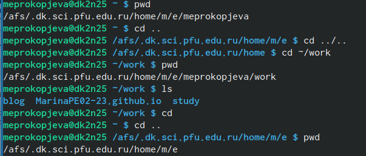{#fig:001 width=70%}

Выводим списки папок в нашем домашнем каталоге 

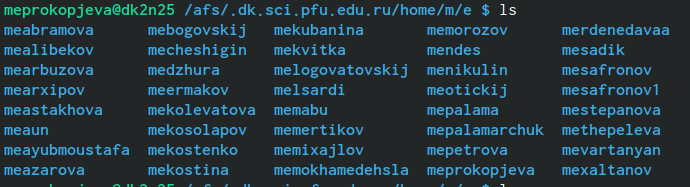{#fig:002 width=70%}

Выводим списоки папок через другую команду 

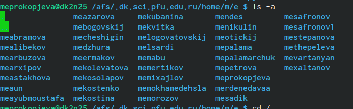{#fig:003 width=70%}

Использовать опцию /

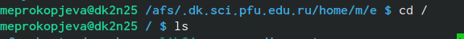{#fig:004 width=70%}

Выводит то что нужно 

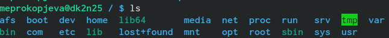{#fig:005 width=70%}

Используем команду чтобы вывели подробную информацию о каталогах 

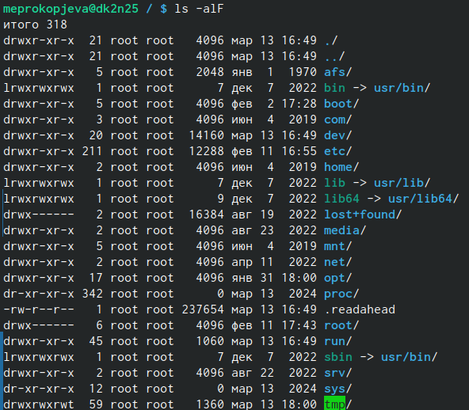{#fig:006 width=70%}

Используем команду создани каталогов и создаем каталог newdir в домашней папке и так же создаем из домашнего каталога файл в новом каталоге 

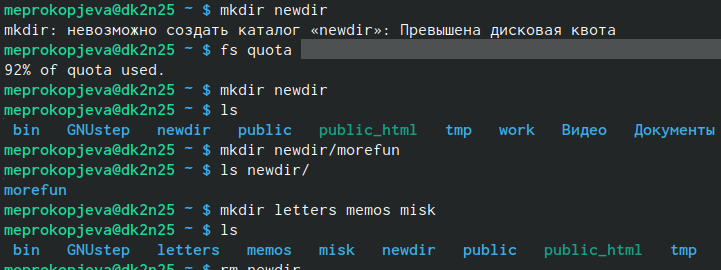{#fig:008 width=70%}

Удаляем созданный каталог и файл в нем 

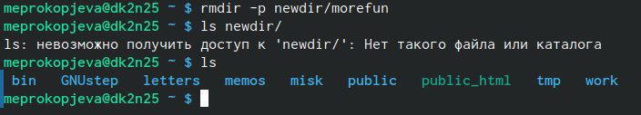{#fig:009 width=70%}

Выводим список команд и изучаем его 

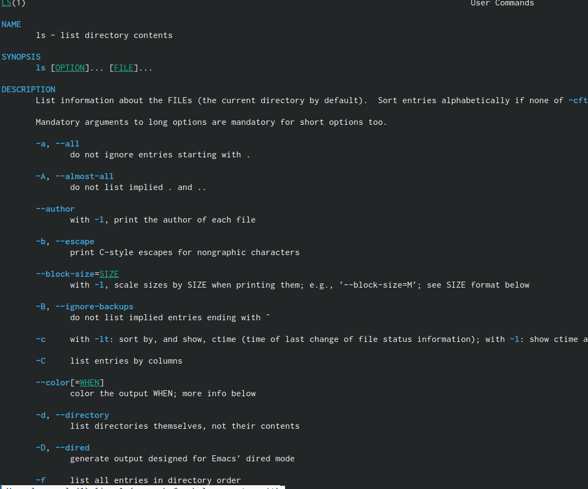{#fig:010 width=70%}

Используем команду man для просмотра в диалоговом режиме

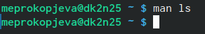{#fig:011 width=70%}

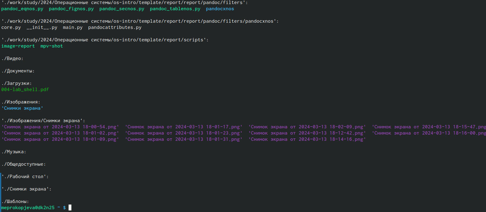{#fig:012 width=70%}

Еще один вариант с использованием man 

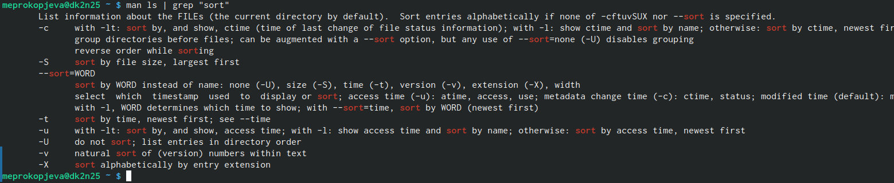{#fig:013 width=70%}

Используем команду для подробной информации о файлах 

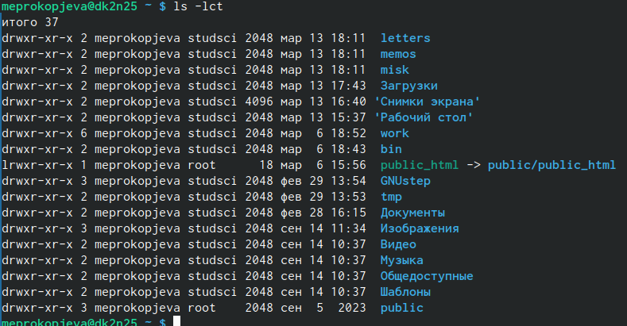{#fig:014 width=70%}

Используем похожую и ищим разницу между ними 

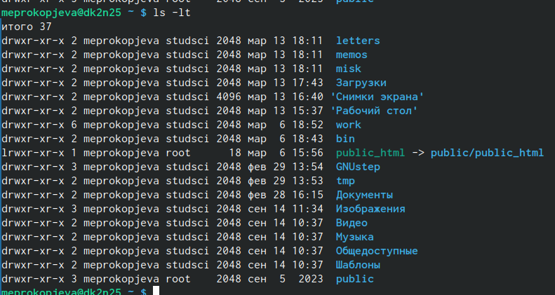{#fig:015 width=70%}

Выводим обычный список файлов разными командами, результат тот же

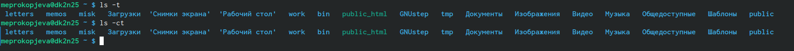{#fig:016 width=70%}

Выводим историю наших команд

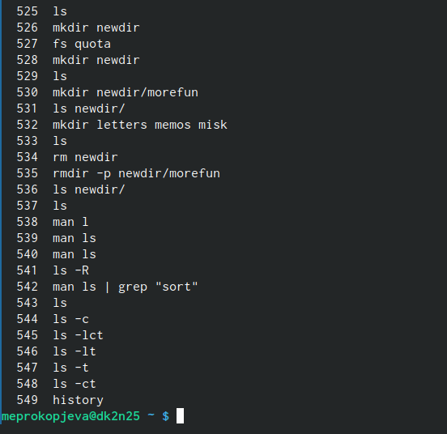{#fig:017 width=70%}

Выполняем команды с помощью истории 

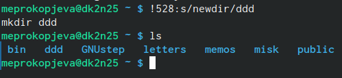{#fig:018 width=70%}

Удаляем созданные файлы 

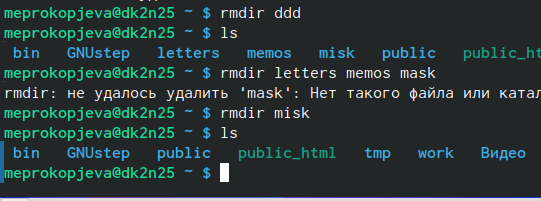{#fig:019 width=70%}

# Выводы

Приобрели практические навыки взаимодействия пользователя с системой посредством командной строки.

:::

