---
## Front matter
lang: ru-RU
title: Лабораторная работа 8
subtitle: Поиск файлов. Перенаправление ввода-вывода. Просмотр запущенных процессов
author:
  - Прокопьева М. Е.
institute:
  - Российский университет дружбы народов, Москва, Россия

## i18n babel
babel-lang: russian
babel-otherlangs: english

## Formatting pdf
toc: false
toc-title: Содержание
slide_level: 2
aspectratio: 169
section-titles: true
theme: metropolis
header-includes:
 - \metroset{progressbar=frametitle,sectionpage=progressbar,numbering=fraction}
 - '\makeatletter'
 - '\beamer@ignorenonframefalse'
 - '\makeatother'
---

# Информация

## Докладчик

  * Прокопьева Марина Евгеньевна
  * студент направления Бизнес Информатики 02-23
  * 1132237370
  * Российский университет дружбы народов

# Вводная часть

# Цель работы

Ознакомление с инструментами поиска файлов и фильтрации текстовых данных.
Приобретение практических навыков: по управлению процессами (и заданиями), по
проверке использования диска и обслуживанию файловых систем.

# Задание

Осуществите вход в систему, используя соответствующее имя пользователя.
2. Запишите в файл file.txt названия файлов, содержащихся в каталоге /etc. Допи-
шите в этот же файл названия файлов, содержащихся в вашем домашнем каталоге.
3. Выведите имена всех файлов из file.txt, имеющих расширение .conf, после чего
запишите их в новый текстовой файл conf.txt.
4. Определите, какие файлы в вашем домашнем каталоге имеют имена, начинавшиеся
с символа c? Предложите несколько вариантов, как это сделать.
5. Выведите на экран (по странично) имена файлов из каталога /etc, начинающиеся
с символа h.
6. Запустите в фоновом режиме процесс, который будет записывать в файл ~/logfile
файлы, имена которых начинаются с log.
7. Удалите файл ~/logfile.
8. Запустите из консоли в фоновом режиме редактор gedit.
9. Определите идентификатор процесса gedit, используя команду ps, конвейер и фильтр
grep. Как ещё можно определить идентификатор процесса?
10. Прочтите справку (man) команды kill, после чего используйте её для завершения
процесса gedit.
11. Выполните команды df и du, предварительно получив более подробную информацию
об этих командах, с помощью команды man.
12. Воспользовавшись справкой команды find, выведите имена всех директорий, имею-
щихся в вашем домашнем каталоге

# Теоретическое введение

В системе по умолчанию открыто три специальных потока:
– stdin — стандартный поток ввода (по умолчанию: клавиатура), файловый дескриптор
0;
– stdout — стандартный поток вывода (по умолчанию: консоль), файловый дескриптор
1;
– stderr — стандартный поток вывод сообщений об ошибках (по умолчанию: консоль),
файловый дескриптор 2.
Большинство используемых в консоли команд и программ записывают результаты
своей работы в стандартный поток вывода stdout. Например, команда ls выводит в стан-
дартный поток вывода (консоль) список файлов в текущей директории. Потоки вывода
и ввода можно перенаправлять на другие файлы или устройства. Проще всего это делается
с помощью символов >, >>, <, <<. Рассмотрим пример.
1 # Перенаправление stdout (вывода) в файл.
2 # Если файл отсутствовал, то он создаётся,
3 # иначе -- перезаписывается.
4
5 # Создаёт файл, содержащий список дерева каталогов.
6 ls -lR > dir-tree.list
7
8 1>filename
9 # Перенаправление вывода (stdout) в файл "filename".
10 1>>filename
11 # Перенаправление вывода (stdout) в файл "filename",
12 # файл открывается в режиме добавления.
13 2>filename
14 # Перенаправление stderr в файл "filename".
15 2>>filename
16 # Перенаправление stderr в файл "filename",
17 # файл открывается в режиме добавления.
18 &>filename
19 # Перенаправление stdout и stderr в файл "filename".

# Выполнение лабораторной работы
1. Вывести на экран имена файлов из вашего домашнего каталога и его подкаталогов,
начинающихся на f:

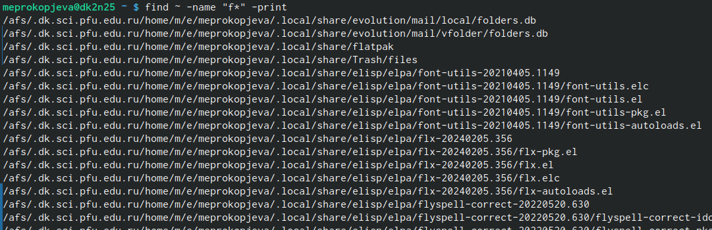{#fig:001 width=70%}

## Вывести на экран имена файлов в каталоге /etc, начинающихся с символа p:

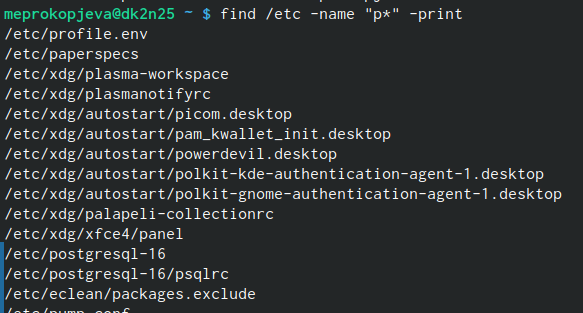{#fig:002 width=70%}

Найти в Вашем домашнем каталоге файлы, имена которых заканчиваются символом
~ и удалить их

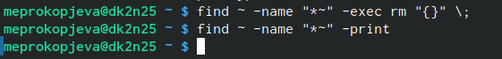{#fig:003 width=70%}

## 2. Показать строки во всех файлах в вашем домашнем каталоге с именами, начинающи-
мися на f, в которых есть слово begin:
1 grep begin f*
Найти в текущем каталоге все файлы, содержащих в имени «лаб»:
1 ls -l | grep лаб 

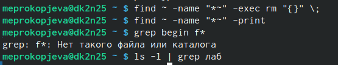{#fig:004 width=70%}

## 3. Команда df показывает размер каждого смонтированного раздела диска.
Формат команды:

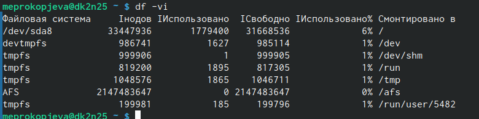{#fig:005 width=70%}

Команда du показывает число килобайт, используемое каждым файлом или каталогом.
Формат команды:

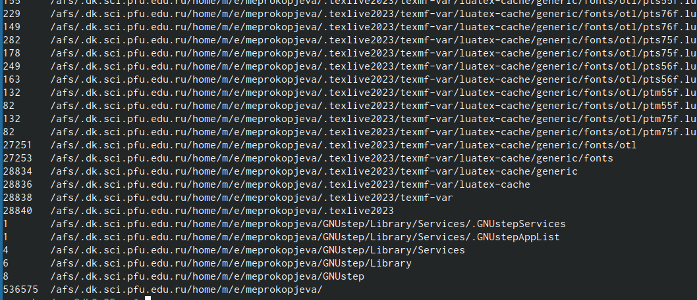{#fig:006 width=70%}

На afs можно посмотреть использованное пространство командой

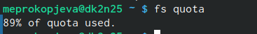{#fig:007 width=70%}

## 4. Любую выполняющуюся в консоли команду или внешнюю программу можно запустить
в фоновом режиме. Для этого следует в конце имени команды указать знак амперсанда
&.

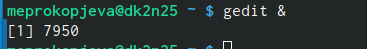{#fig:008 width=70%}

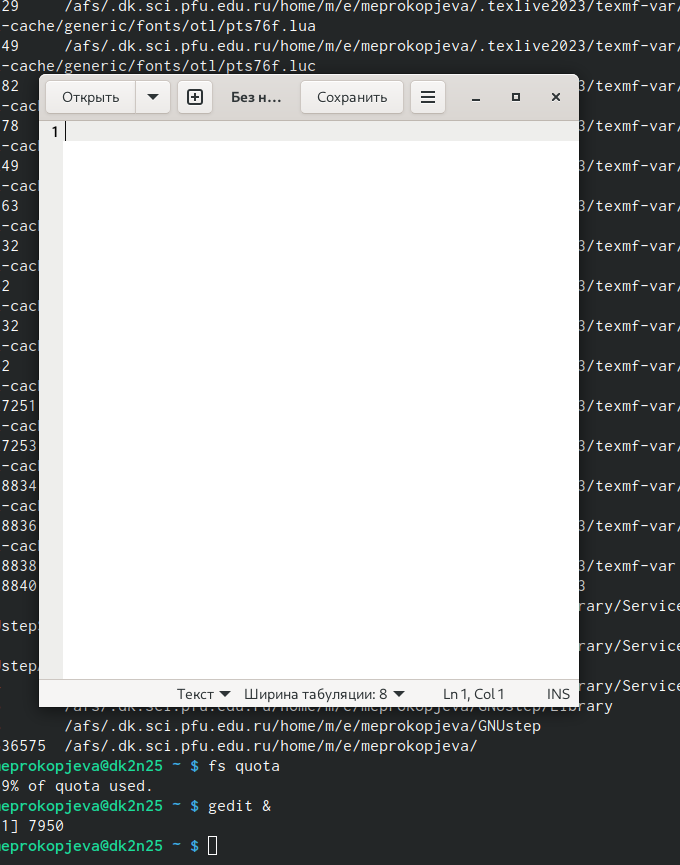{#fig:009 width=70%}

Запущенные фоном программы называются задачами (jobs). Ими можно управлять
с помощью команды jobs, которая выводит список запущенных в данный момент задач.
Для завершения задачи необходимо выполнить команду

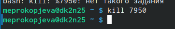{#fig:010 width=70%}

## 5. Команда ps используется для получения информации о процессах.
Формат команды 

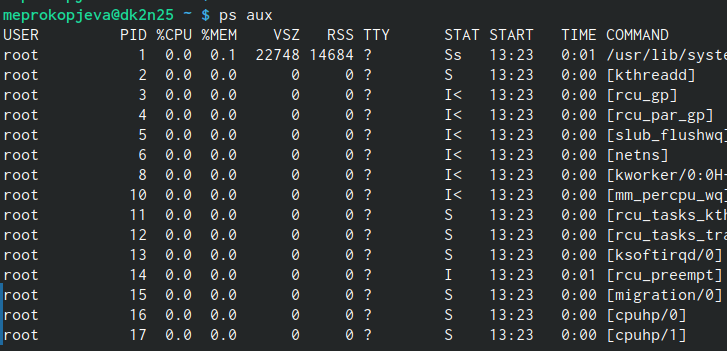{#fig:011 width=70%}

Для запуска команды в фоновом режиме необходимо в конце командной строки ука-
зать знак & (амперсанд).
Пример работы, требующей много машинного времени для выполнения, и которую
целесообразно запустить в фоновом режиме:

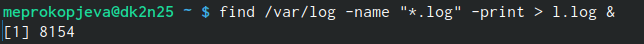{#fig:012 width=70%}

## Выполнение рабоаты

Запишите в файл file.txt названия файлов, содержащихся в каталоге /etc. Допи-
шите в этот же файл названия файлов, содержащихся в вашем домашнем каталоге 

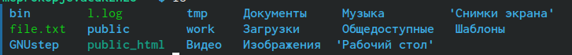{#fig:013 width=70%}

{#fig:014 width=70%}

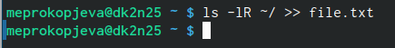{#fig:015 width=70%}

## Выведите имена всех файлов из file.txt, имеющих расширение .conf, после чего
запишите их в новый текстовой файл conf.txt

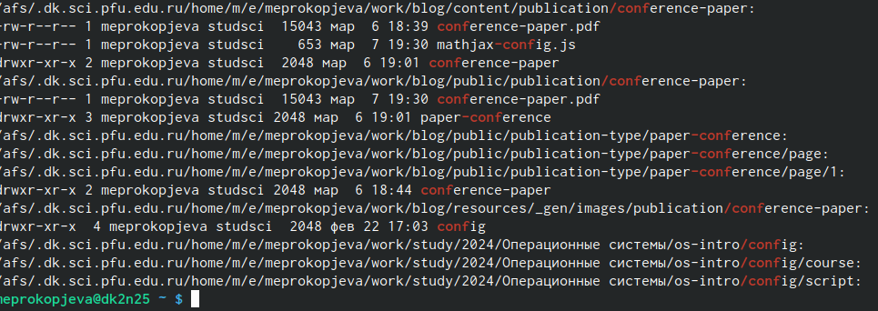{#fig:016 width=70%}

## Определите, какие файлы в вашем домашнем каталоге имеют имена, начинавшиеся
с символа c? Предложите несколько вариантов, как это сделать.

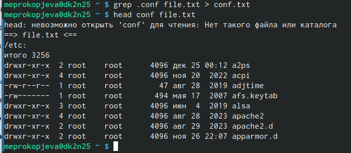{#fig:017 width=70%}

{#fig:018 width=70%}

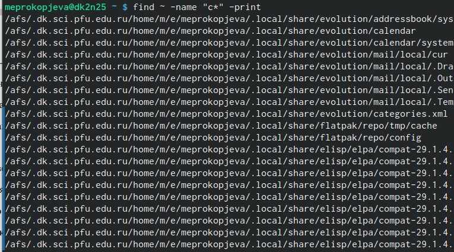{#fig:019 width=70%}

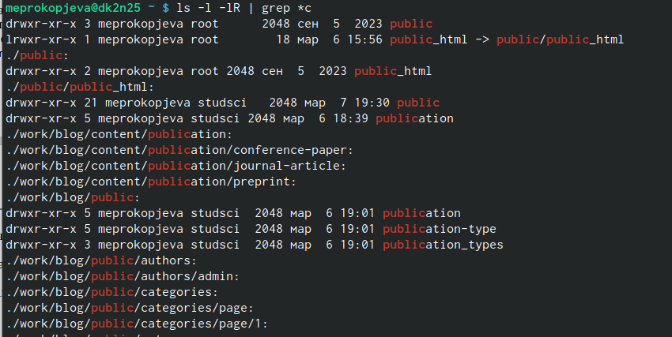{#fig:020 width=70%}

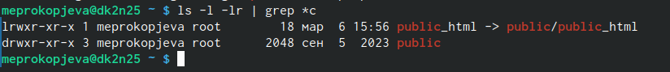{#fig:021 width=70%}

## Запустите в фоновом режиме процесс, который будет записывать в файл ~/logfile
файлы, имена которых начинаются с log

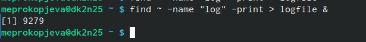{#fig:022 width=70%}

Удалите файл ~/logfile.

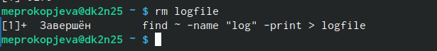{#fig:023 width=70%}

## Определите идентификатор процесса gedit, используя команду ps, конвейер и фильтр
grep.

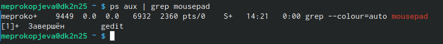{#fig:024 width=70%}

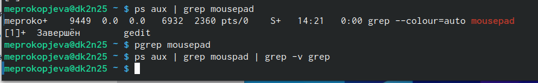{#fig:025 width=70%}

## Прочтите справку (man) команды kill, после чего используйте её для завершения
процесса gedit.

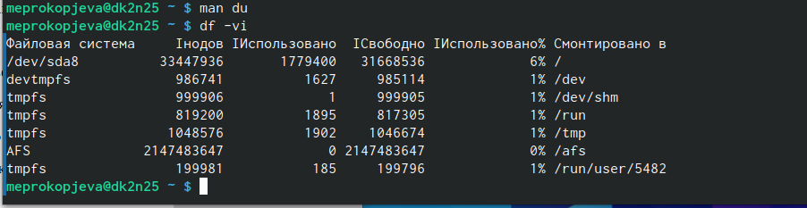{#fig:026 width=70%}

Выполните команды df и du, предварительно получив более подробную информацию
об этих командах, с помощью команды man. 

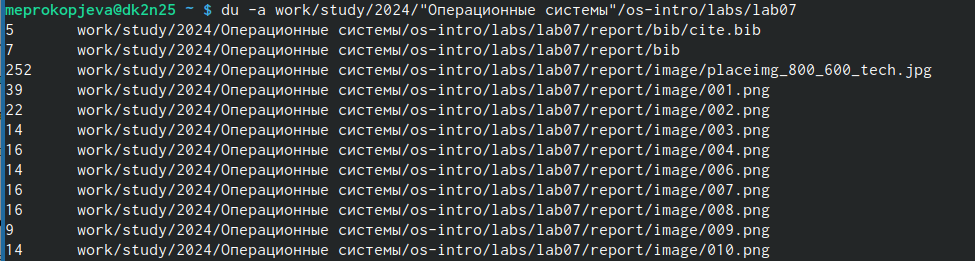{#fig:027 width=70%}

## Воспользовавшись справкой команды find, выведите имена всех директорий, имею-
щихся в вашем домашнем каталоге 

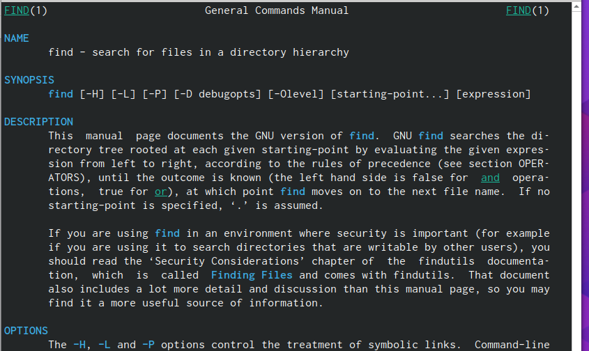{#fig:028 width=70%}

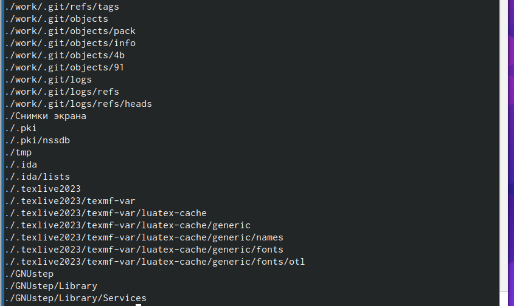{#fig:029 width=70%}

# Выводы

Ознакомились с инструментами поиска файлов и фильтрации текстовых данных.
Приобрили практических навыков: по управлению процессами (и заданиями), по
проверке использования диска и обслуживанию файловых систем.
