---
## Front matter
lang: ru-RU
title: Лабораторная номер 10
subtitle: Текстовой редактор vi
author:
  - Прокопьева М. Е.
institute:
  - Российский университет дружбы народов, Москва, Россия

## i18n babel
babel-lang: russian
babel-otherlangs: english

## Formatting pdf
toc: false
toc-title: Содержание
slide_level: 2
aspectratio: 169
section-titles: true
theme: metropolis
header-includes:
 - \metroset{progressbar=frametitle,sectionpage=progressbar,numbering=fraction}
 - '\makeatletter'
 - '\beamer@ignorenonframefalse'
 - '\makeatother'
---

# Информация

## Докладчик

  * Прокопьева Марина Евгеньевна 
  * Студент 
  * ФФМиЕН
  * Российский университет дружбы народов

# Вводная часть

# Цель работы

Познакомиться с операционной системой Linux. Получить практические навыки рабо-
ты с редактором vi, установленным по умолчанию практически во всех дистрибутивах.

# Указания к работе

В большинстве дистрибутивов Linux в качестве текстового редактора по умолчанию
устанавливается интерактивный экранный редактор vi (Visual display editor).
Редактор vi имеет три режима работы:
– командный режим — предназначен для ввода команд редактирования и навигации по
редактируемому файлу;
– режим вставки — предназначен для ввода содержания редактируемого файла;
– режим последней (или командной) строки — используется для записи изменений в файл
и выхода из редактора.
Для вызова редактора vi необходимо указать команду vi и имя редактируемого файла:
vi <имя_файла>
При этом в случае отсутствия файла с указанным именем будет создан такой файл.
Переход в командный режим осуществляется нажатием клавиши Esc . Для выхода из
редактора vi необходимо перейти в режим последней строки: находясь в командном
режиме, нажать Shift-; (по сути символ : — двоеточие), затем:
– набрать символы wq, если перед выходом из редактора требуется записать изменения
в файл;
– набрать символ q (или q!), если требуется выйти из редактора без сохранения.
Замечание. Следует помнить, что vi различает прописные и строчные буквы при наборе
(восприятии) команд.

# Теоретическое введение
		Команды управления курсором
	Команды позиционирования
– 0 (ноль) — переход в начало строки;
– $ — переход в конец строки;
– G — переход в конец файла;
– 𝑛 G — переход на строку с номером 𝑛.
	Команды перемещения по файлу
– Ctrl-d — перейти на пол-экрана вперёд;
– Ctrl-u — перейти на пол-экрана назад;
– Ctrl-f — перейти на страницу вперёд;
– Ctrl-b — перейти на страницу назад.
##	Команды перемещения по словам1
– W или w — перейти на слово вперёд;
– 𝑛 W или 𝑛 w — перейти на 𝑛 слов вперёд;
– b или B — перейти на слово назад;
– 𝑛 b или 𝑛 B — перейти на 𝑛 слов назад.
		Команды редактирования
	Вставка текста
– а — вставить текст после курсора;
– А — вставить текст в конец строки;
– i — вставить текст перед курсором;
– 𝑛 i — вставить текст 𝑛 раз;
– I — вставить текст в начало строки.
	Вставка строки
– о — вставить строку под курсором;
– О — вставить строку над курсором.
##	Удаление текста
– x — удалить один символ в буфер;
– d w — удалить одно слово в буфер;
– d $ — удалить в буфер текст от курсора до конца строки;
– d 0 — удалить в буфер текст от начала строки до позиции курсора;
– d d — удалить в буфер одну строку;
– 𝑛 d d — удалить в буфер 𝑛 строк

# Выполнение лабораторной работы

Задание 1 

1. Создайте каталог с именем ~/work/os/lab06. Перейдите в него и вызовите vi

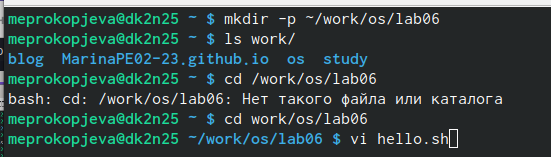{#fig:001 width=70%}

2. Нажмите клавишу i и ввела текст

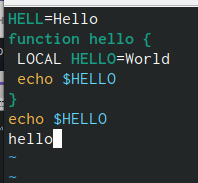{#fig:002 width=70%}

3. Нажала на :

{#fig:003 width=70%}

4. Нажада на w и q и сохранила текст

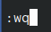{#fig:004 width=70%}

5. Сделала файл исполняемым 

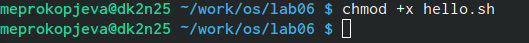{#fig:005 width=70%}

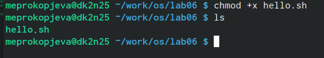{#fig:006 width=70%}

Задание 2

1. Вызвала на редактирование файла

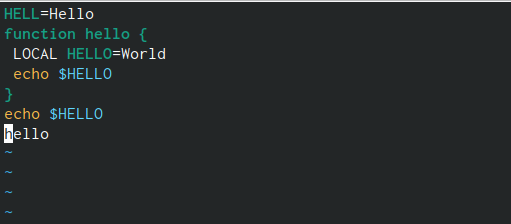{#fig:007 width=70%}

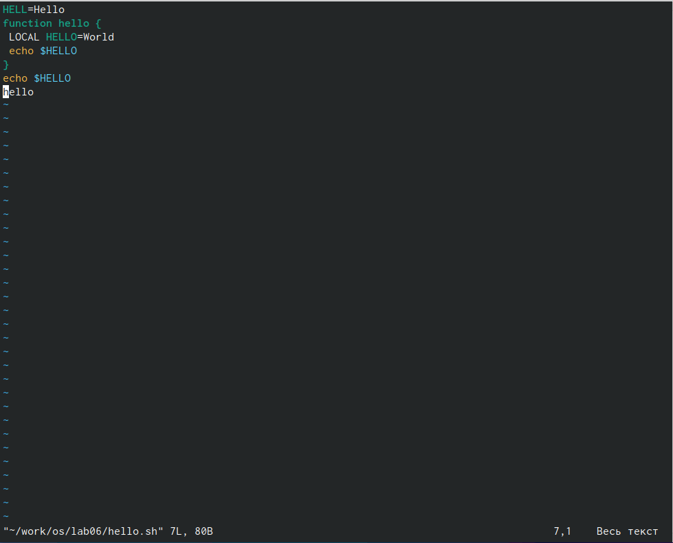{#fig:008 width=70%}

2. Установила курсор

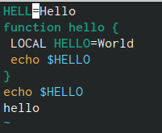{#fig:009 width=70%}

3. Поменяла слово 

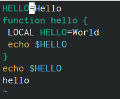{#fig:010 width=70%}

4. Установила курсор и поменяла слово

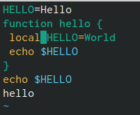{#fig:011 width=70%}

5. Ввела в конце текст 

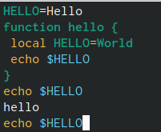{#fig:012 width=70%}

6. Удалила текст 

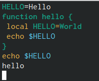{#fig:013 width=70%}

7. Востановила текст с помощью клавиши U 

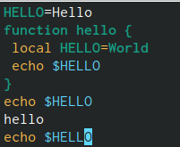{#fig:014 width=70%}

8. Вышла из vi сохранив код 

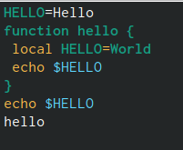{#fig:015 width=70%}

# Выводы

Познакомилась с операционной системой Linux. Получила практические навыки рабо-
ты с редактором vi, установленным по умолчанию практически во всех дистрибутивах.
- Текст используется, если все предыдущие способы отображения информации не подошли

:::

