---
## Front matter
title: "Индивидуальный проект"
subtitle: "Первый этап"
author: "Прокопьева Марина Евгеньевна"

## Generic otions
lang: ru-RU
toc-title: "Содержание"

## Bibliography
bibliography: bib/cite.bib
csl: pandoc/csl/gost-r-7-0-5-2008-numeric.csl

## Pdf output format
toc: true # Table of contents
toc-depth: 2
lof: true # List of figures
lot: true # List of tables
fontsize: 12pt
linestretch: 1.5
papersize: a4
documentclass: scrreprt
## I18n polyglossia
polyglossia-lang:
  name: russian
  options:
	- spelling=modern
	- babelshorthands=true
polyglossia-otherlangs:
  name: english
## I18n babel
babel-lang: russian
babel-otherlangs: english
## Fonts
mainfont: PT Serif
romanfont: PT Serif
sansfont: PT Sans
monofont: PT Mono
mainfontoptions: Ligatures=TeX
romanfontoptions: Ligatures=TeX
sansfontoptions: Ligatures=TeX,Scale=MatchLowercase
monofontoptions: Scale=MatchLowercase,Scale=0.9
## Biblatex
biblatex: true
biblio-style: "gost-numeric"
biblatexoptions:
  - parentracker=true
  - backend=biber
  - hyperref=auto
  - language=auto
  - autolang=other*
  - citestyle=gost-numeric
## Pandoc-crossref LaTeX customization
figureTitle: "Рис."
tableTitle: "Таблица"
listingTitle: "Листинг"
lofTitle: "Список иллюстраций"
lotTitle: "Список таблиц"
lolTitle: "Листинги"
## Misc options
indent: true
header-includes:
  - \usepackage{indentfirst}
  - \usepackage{float} # keep figures where there are in the text
  - \floatplacement{figure}{H} # keep figures where there are in the text
---

# Цель работы

Размещение на Github pages заготовки для персонального сайта.

# Задание

Установить необходимое программное обеспечение.
Скачать шаблон темы сайта.
Разместить его на хостинге git.
Установить параметр для URLs сайта.
Разместить заготовку сайта на Github pages.

# Выполнение индивидуального проекта

1. Скачивание файла hugo-extended

{#fig:001 width=70%}

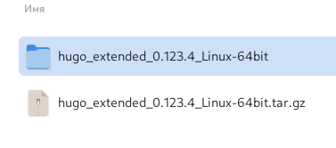{#fig:002 width=70%}

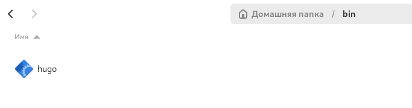{#fig:003 width=70%}

2. Создание репозитория project по шаблону и клонирование

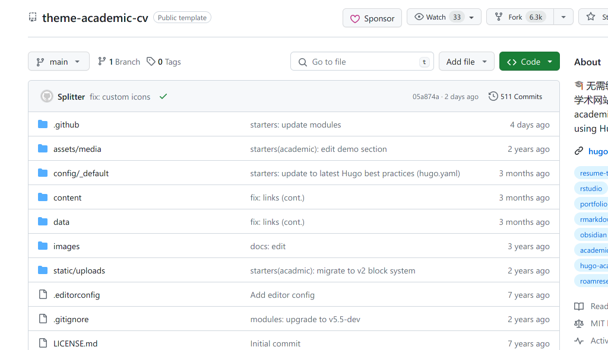{#fig:004 width=70%}

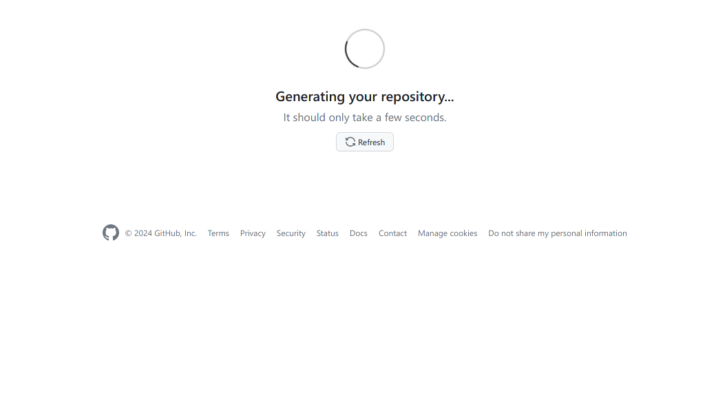{#fig:005 width=70%}

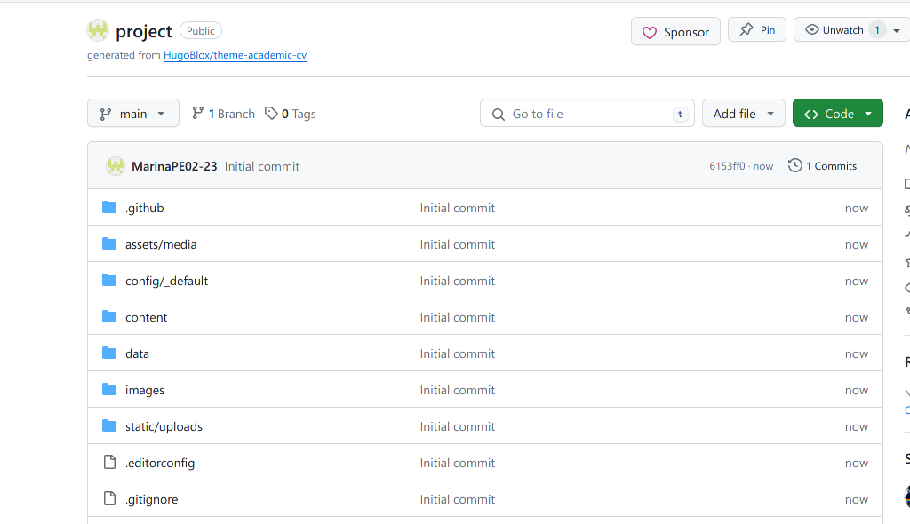{#fig:006 width=70%}

3. Скачивание модулей hugo 

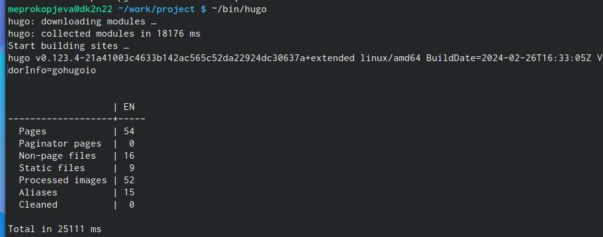{#fig:008 width=70%}

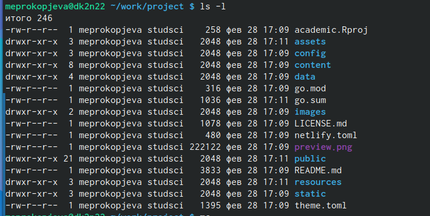{#fig:009 width=70%}

4.  Удаление ненужных файлов 

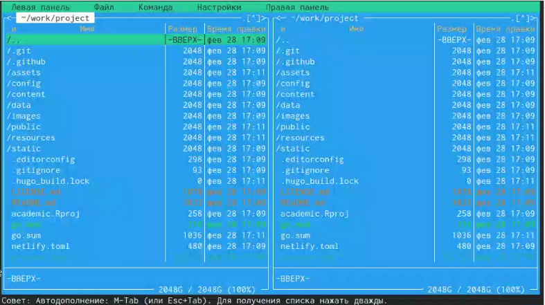{#fig:025 width=70%}

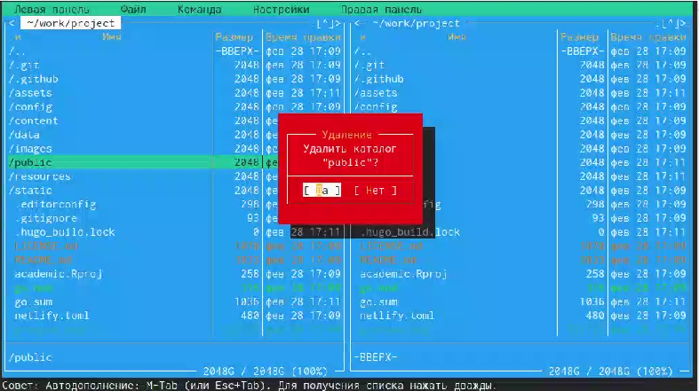{#fig:026 width=70%}

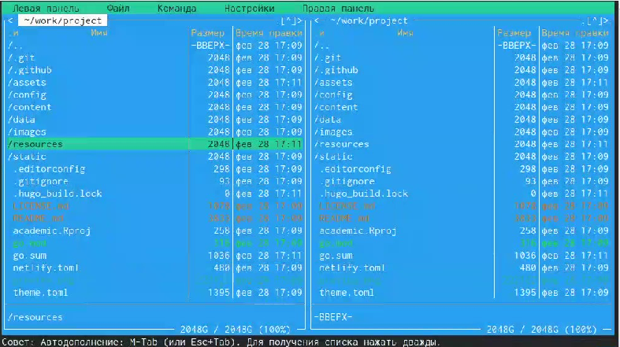{#fig:027 width=70%}

5. Подключение к серверу 

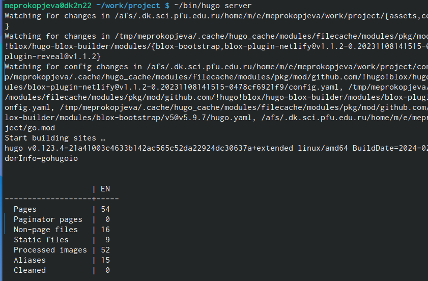{#fig:010 width=70%}

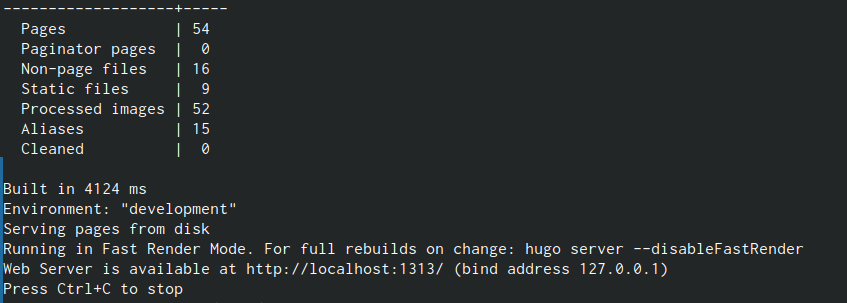{#fig:011 width=70%}

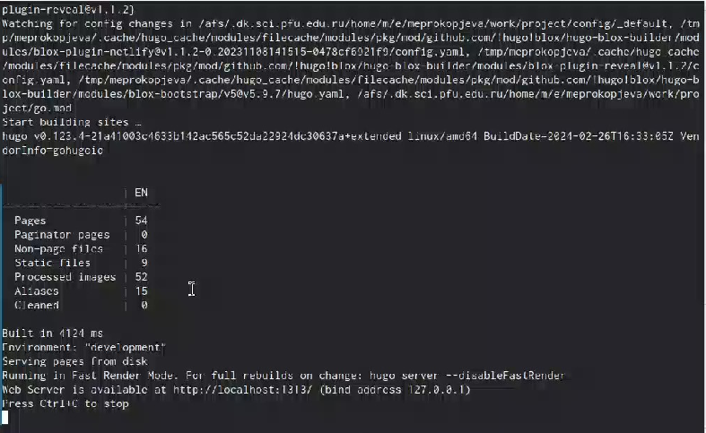{#fig:028 width=70%}

{#fig:031 width=70%}

6. Создание нового репозитория MarinaPE02-23

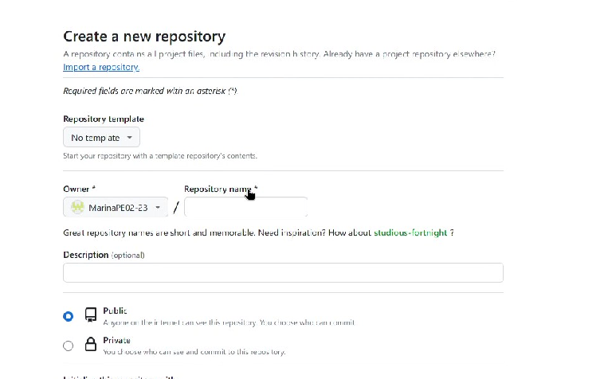{#fig:0029 width=70%} 

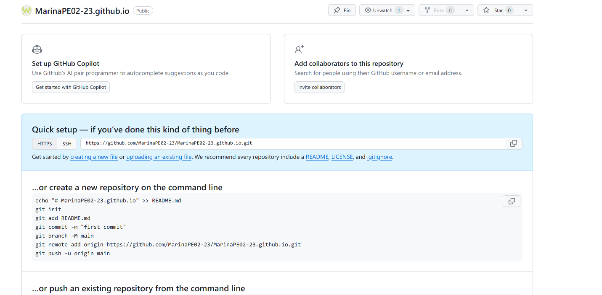{#fig:012 width=70%}

7. Клонирование 

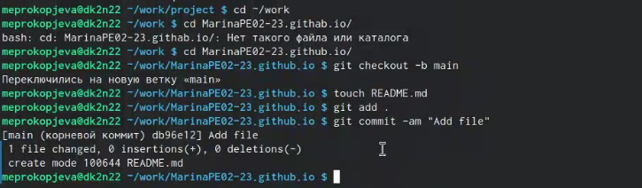{#fig:033 width=70%}

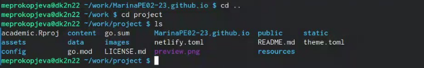{#fig:034 width=70%}

8. Добавление файлов в репозиторий 

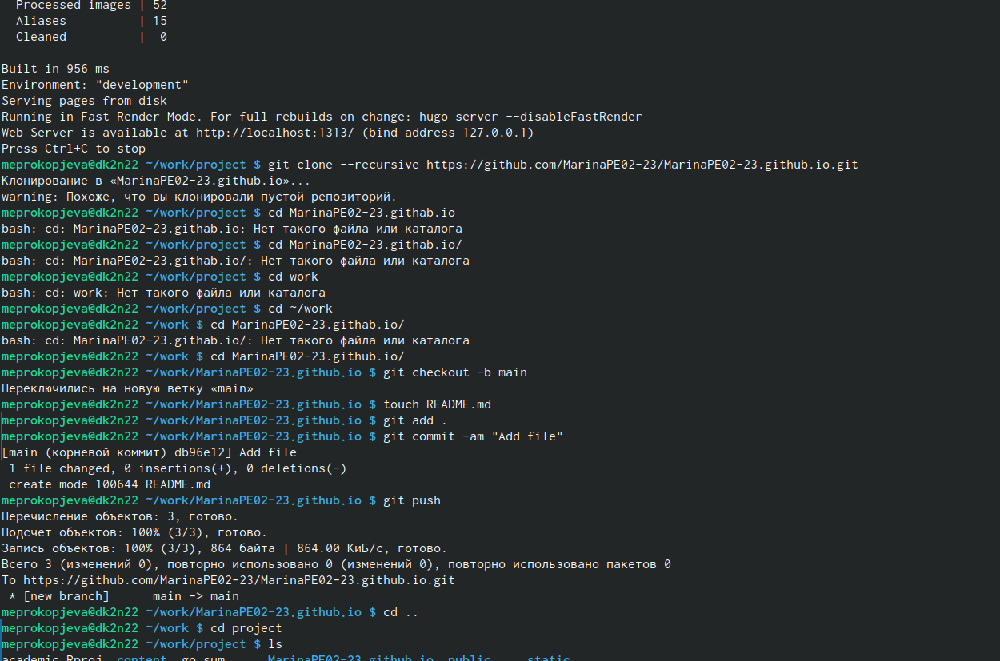{#fig:017 width=70%}

9. Изменение файла .gitignore и дальнейшие этапы 
 
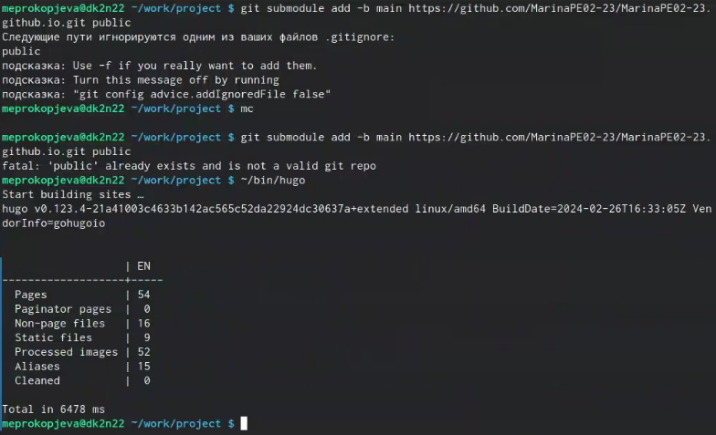{#fig:036 width=70%}

10. Заходим на наш сайт 

{#fig:019 width=70%}

# Выводы

Разместили на Github pages заготовки для персонального сайта.
