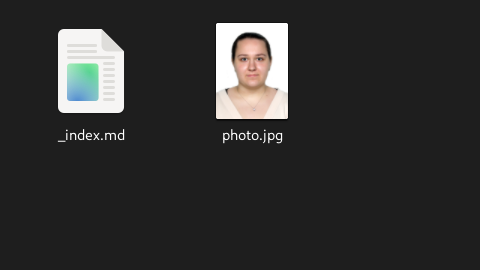
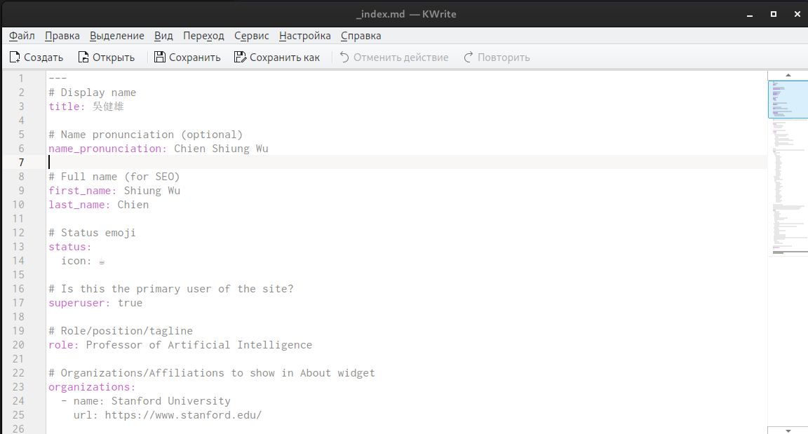
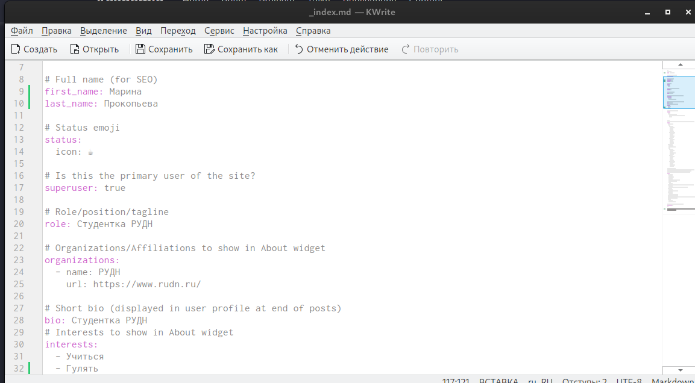
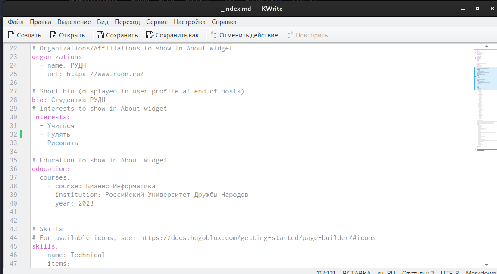
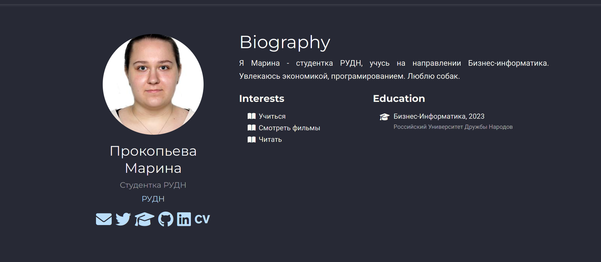
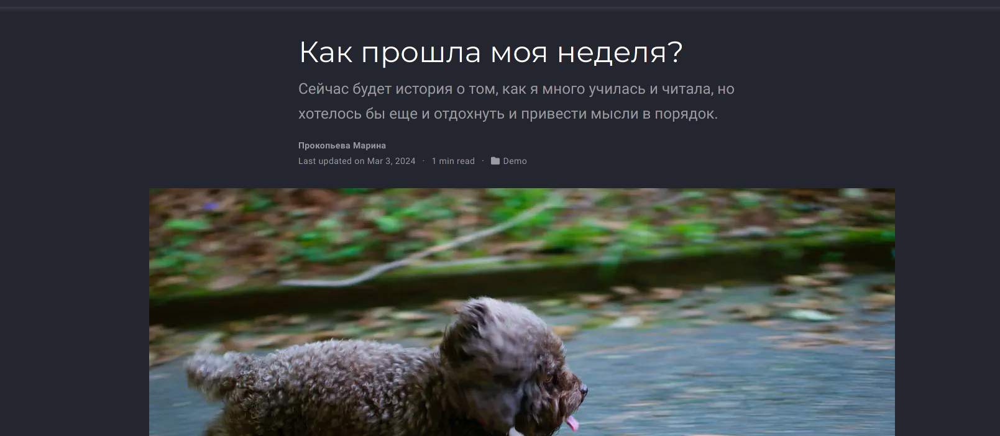
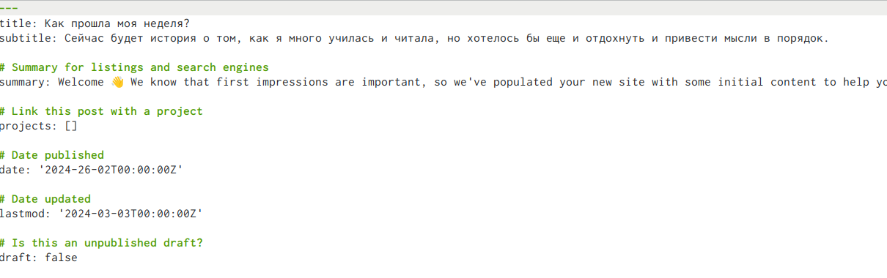
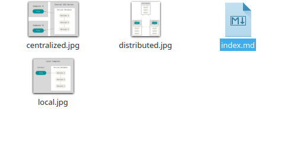
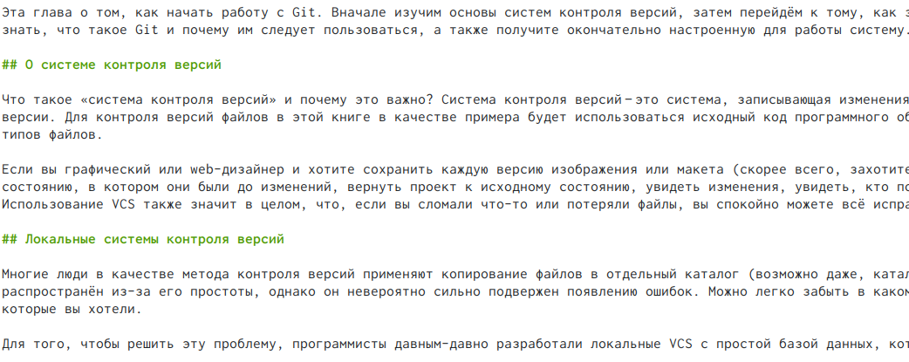
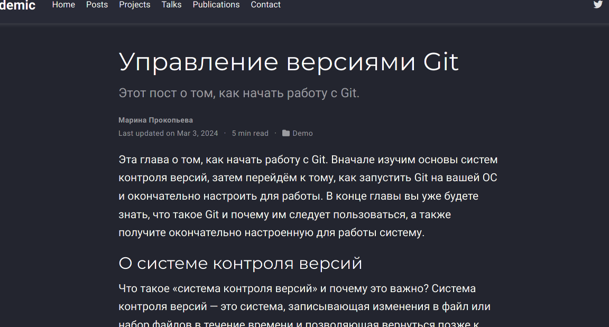

---
## Front matter
lang: ru-RU
title: Второй этап
subtitle: Индивидуальный проект
author:
  - Прокопьева М. Е.
institute:
  - Российский университет дружбы народов, Москва, Россия
date: 13 марта 2024

## i18n babel
babel-lang: russian
babel-otherlangs: english

## Formatting pdf
toc: false
toc-title: Содержание
slide_level: 2
aspectratio: 169
section-titles: true
theme: metropolis
header-includes:
 - \metroset{progressbar=frametitle,sectionpage=progressbar,numbering=fraction}
 - '\makeatletter'
 - '\beamer@ignorenonframefalse'
 - '\makeatother'
---

# Информация

## Докладчик

  * Прокопьева Марина Евгеньевна
  * студент
  * 1132237370
  * Российский университет дружбы народов

# Вводная часть

# Цель работы

Добавить к сайту данные о себе.

# Задание

Список добавляемых данных.
   Разместить фотографию владельца сайта.
   Разместить краткое описание владельца сайта (Biography).
   Добавить информацию об интересах (Interests).
   Добавить информацию от образовании (Education).
Сделать пост по прошедшей неделе.
Добавить пост на тему по выбору:
    Управление версиями. Git.
    Непрерывная интеграция и непрерывное развертывание (CI/CD).
    
# Выполнение задач

Мы заходим в папки /work/blog/content/authors и заменяем фотографию

{#fig:001 width=70%}

## Мы можем заметить там файл с информацией об авторе. Открываем его и так же меняем на свою информацию. 

{#fig:002 width=70%}

{#fig:003 width=70%}

## Screen

{#fig:004 width=70%}

{#fig:005 width=70%}

## Заходим в папку /work/blog/content/post

Изменяем на тему, как мы провели неделю

{#fig:006 width=70%}

{#fig:007 width=70%}

## Дальше мы выбираем тему поста и это управоение версиями git.

{#fig:008 width=70%}

{#fig:009 width=70%}

## Screen

{#fig:010 width=70%}

# Выводы

 Мы добавили на сайте информацию о себе.
 
 

