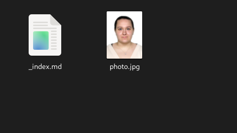
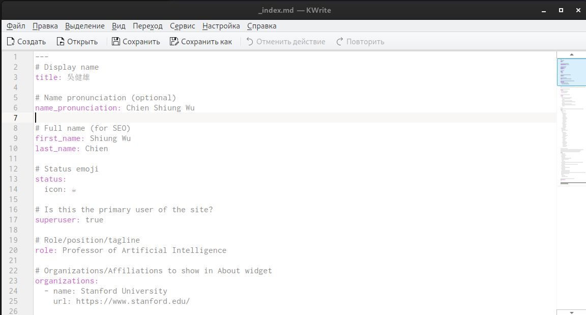
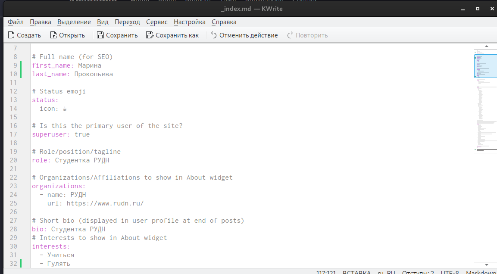
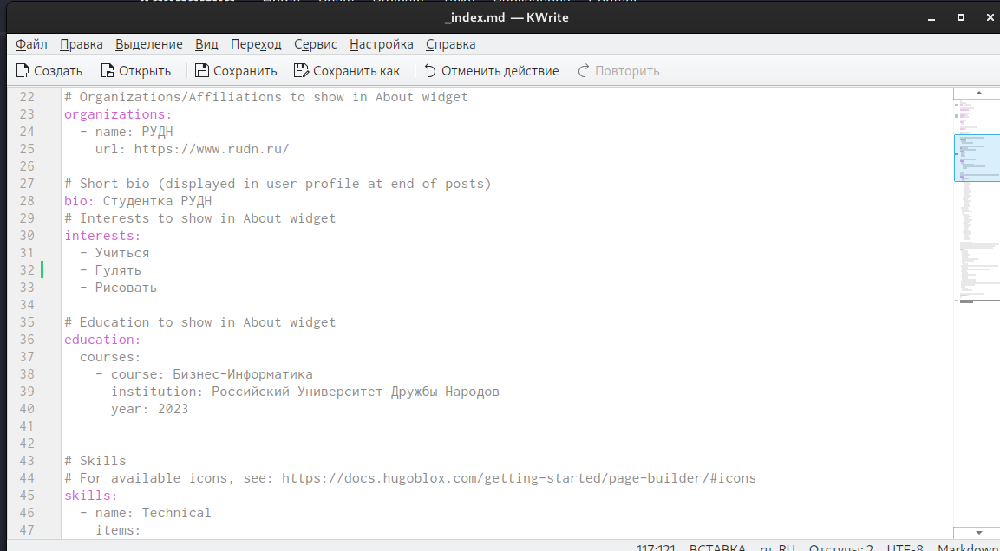
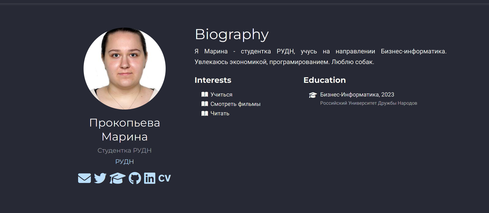
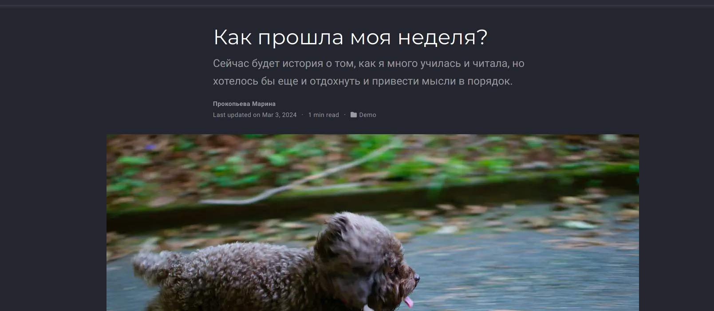
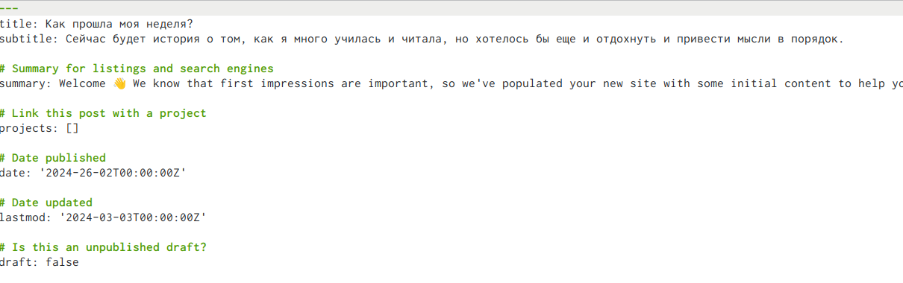
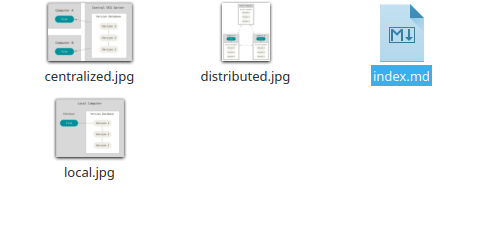
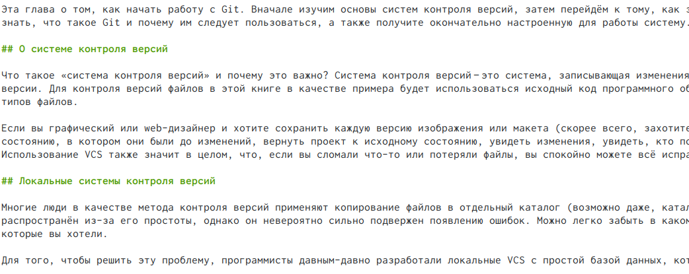
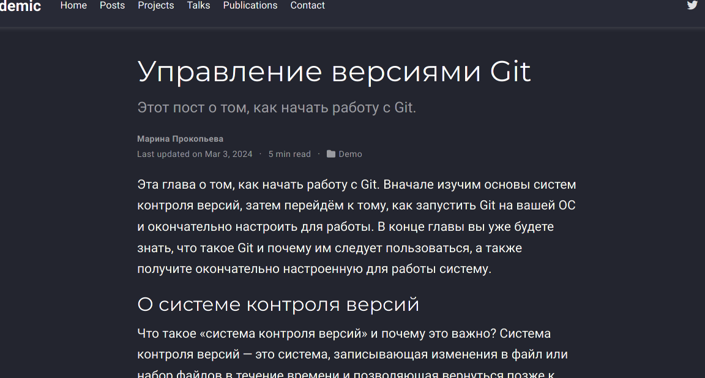

---
## Front matter
title: "Индивидуальный проект"
subtitle: "Второй этап"
author: "Прокопьева Марина Евгеньевна"

## Generic otions
lang: ru-RU
toc-title: "Содержание"

## Bibliography
bibliography: bib/cite.bib
csl: pandoc/csl/gost-r-7-0-5-2008-numeric.csl

## Pdf output format
toc: true # Table of contents
toc-depth: 2
lof: true # List of figures
lot: true # List of tables
fontsize: 12pt
linestretch: 1.5
papersize: a4
documentclass: scrreprt
## I18n polyglossia
polyglossia-lang:
  name: russian
  options:
	- spelling=modern
	- babelshorthands=true
polyglossia-otherlangs:
  name: english
## I18n babel
babel-lang: russian
babel-otherlangs: english
## Fonts
mainfont: PT Serif
romanfont: PT Serif
sansfont: PT Sans
monofont: PT Mono
mainfontoptions: Ligatures=TeX
romanfontoptions: Ligatures=TeX
sansfontoptions: Ligatures=TeX,Scale=MatchLowercase
monofontoptions: Scale=MatchLowercase,Scale=0.9
## Biblatex
biblatex: true
biblio-style: "gost-numeric"
biblatexoptions:
  - parentracker=true
  - backend=biber
  - hyperref=auto
  - language=auto
  - autolang=other*
  - citestyle=gost-numeric
  
## Misc options

indent: true
header-includes:
  - \usepackage{indentfirst}
  - \usepackage{float} # keep figures where there are in the text
  - \floatplacement{figure}{H} # keep figures where there are in the text
---

# Цель работы

Добавить к сайту данные о себе.

# Задание

Список добавляемых данных.
   Разместить фотографию владельца сайта.
   Разместить краткое описание владельца сайта (Biography).
   Добавить информацию об интересах (Interests).
   Добавить информацию от образовании (Education).
Сделать пост по прошедшей неделе.
Добавить пост на тему по выбору:
    Управление версиями. Git.
    Непрерывная интеграция и непрерывное развертывание (CI/CD).

# Выполнение задач

Мы заходим в папки /work/blog/content/authors и заменяем фотографию

{#fig:001 width=70%}

Мы можем заметить там файл с информацией об авторе. Открываем его и так же меняем на свою информацию. 

{#fig:002 width=70%}

{#fig:003 width=70%}

{#fig:004 width=70%}

{#fig:005 width=70%}

Заходим в папку /work/blog/content/post
Изменяем на тему, как мы провели неделю

{#fig:006 width=70%}

{#fig:007 width=70%}

Дальше мы выбираем тему поста и это управоение версиями git.

{#fig:008 width=70%}

{#fig:009 width=70%}

{#fig:010 width=70%}

# Выводы

 Мы добавили на сайте информацию о себе.

