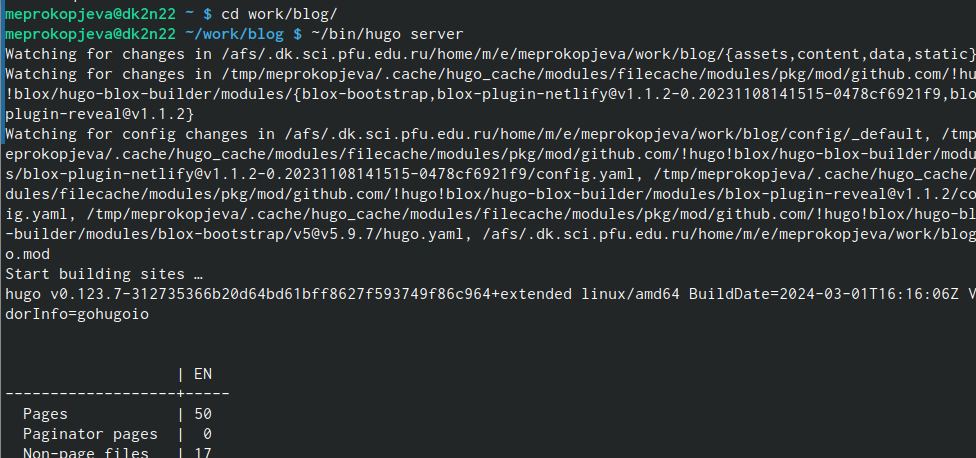
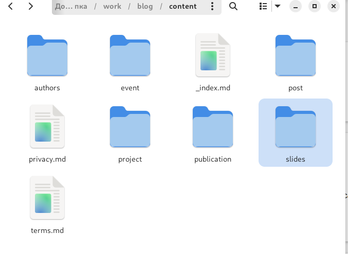
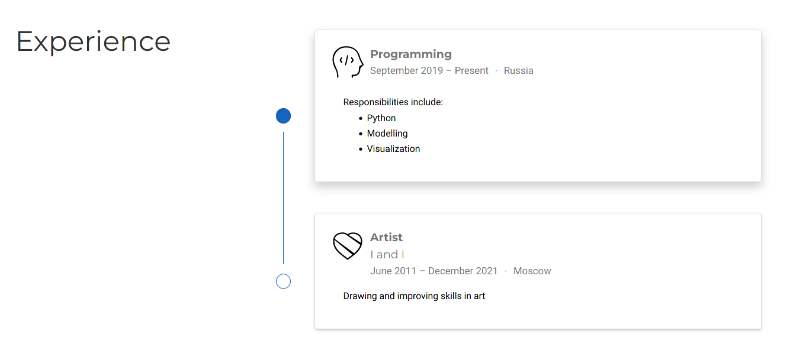
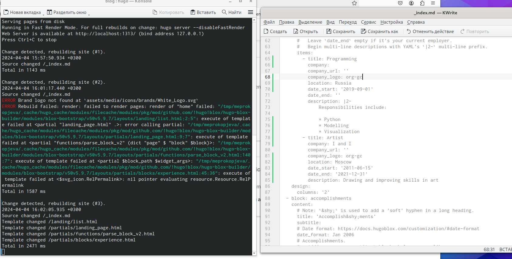
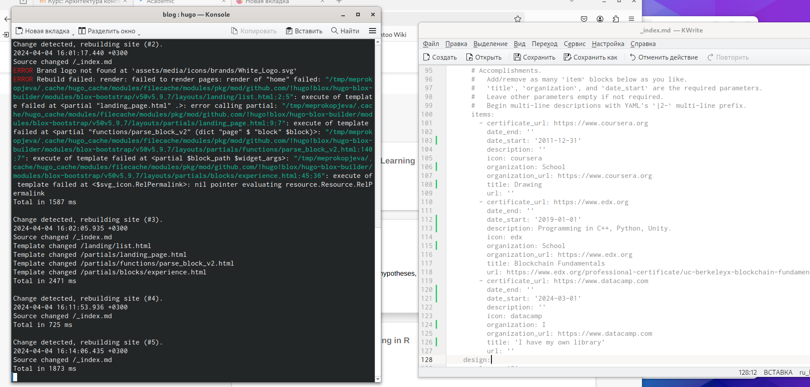

---
## Front matter
lang: ru-RU
title: Индивидуальный проект
subtitle: Третий этап
author:
  - Прокопьева М. Е.
institute:
  - Российский университет дружбы народов, Москва, Россия

## i18n babel
babel-lang: russian
babel-otherlangs: english

## Formatting pdf
toc: false
toc-title: Содержание
slide_level: 2
aspectratio: 169
section-titles: true
theme: metropolis
header-includes:
 - \metroset{progressbar=frametitle,sectionpage=progressbar,numbering=fraction}
 - '\makeatletter'
 - '\beamer@ignorenonframefalse'
 - '\makeatother'
---

# Информация

## Докладчик

  * Прокопьева Марина Евгеньевна
  * Студент
  * ФФМиЕН
  * Российский университет дружбы народов

# Вводная часть

# Цель работы

Добавить к сайту достижения
# Задание

Список достижений
Пост о прошедшей неделе 
Пост на выбор

# Выполнение задач

Мы заходим в папки /bin/Hugo и подключаемся к серверу

{#fig:001 width=70%}

Заходим в папку /work/blog/content/post
Изменяем на тему, как мы провели неделю, список достижений и пост о разметке Макрдаун 

{#fig:002 width=70%}

## 

{#fig:003 width=70%}

## 

{#fig:004 width=70%}

##

{#fig:005 width=70%}

# Выводы

 Мы добавили на сайте информацию о достижений. 

