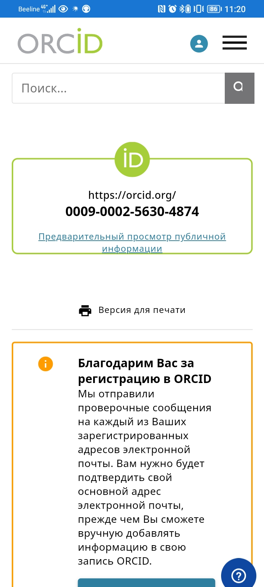
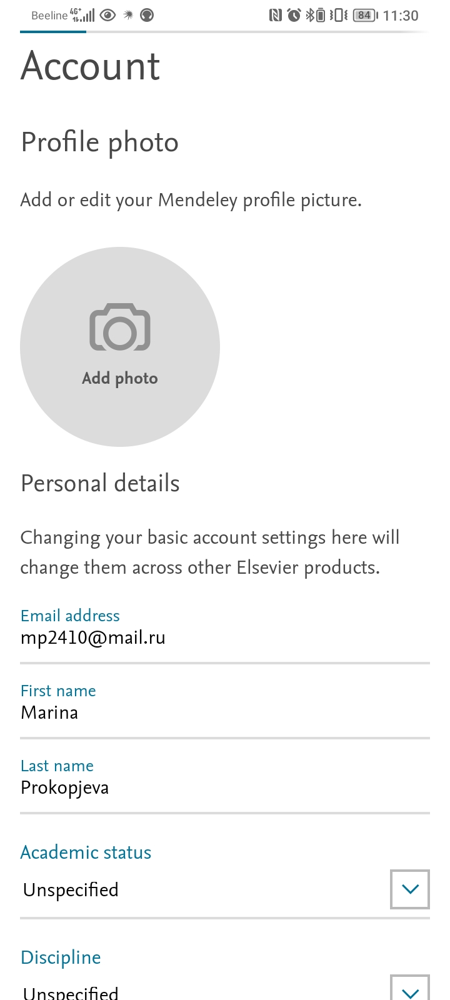
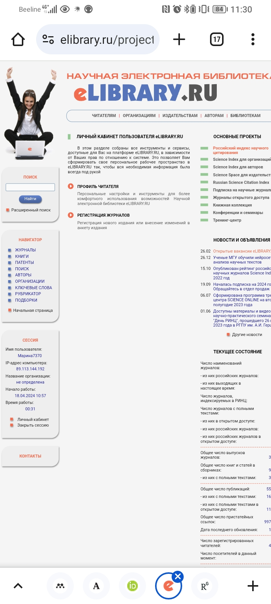
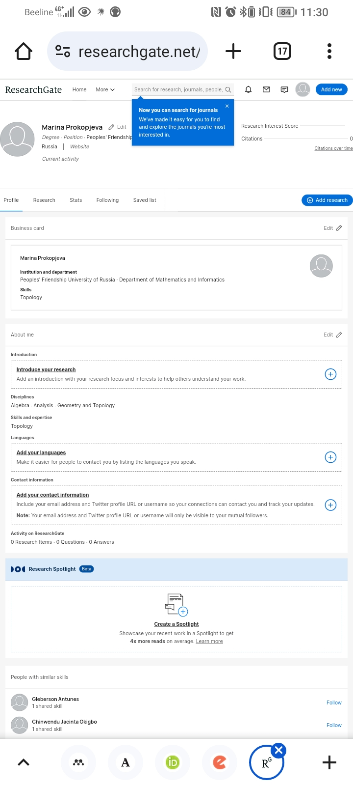
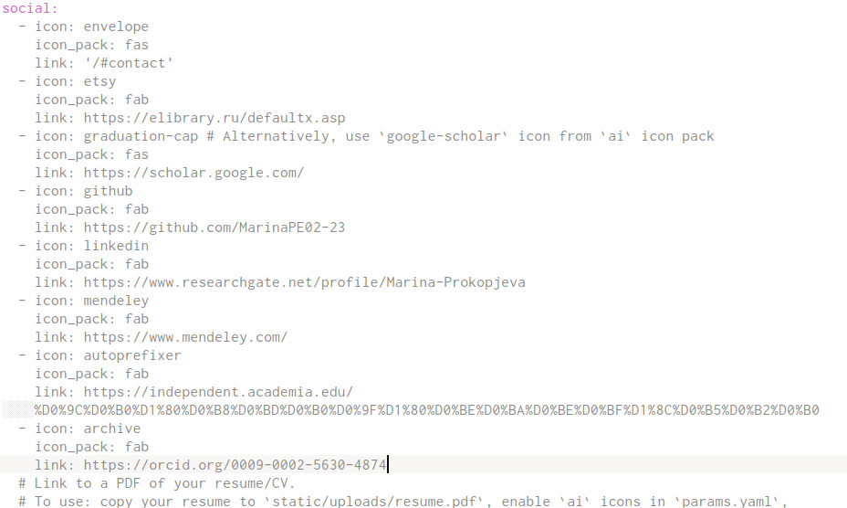
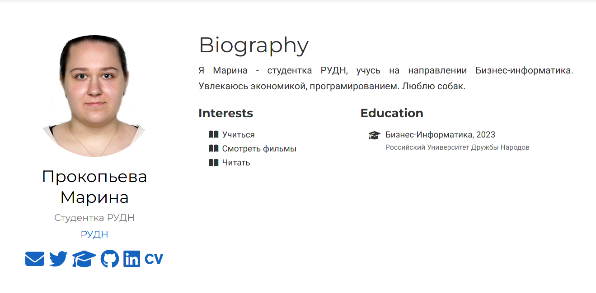
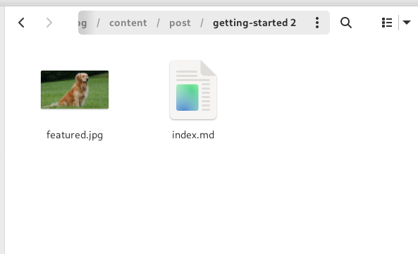
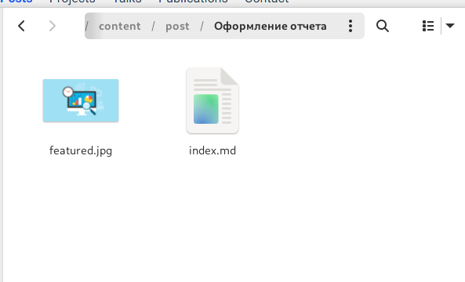
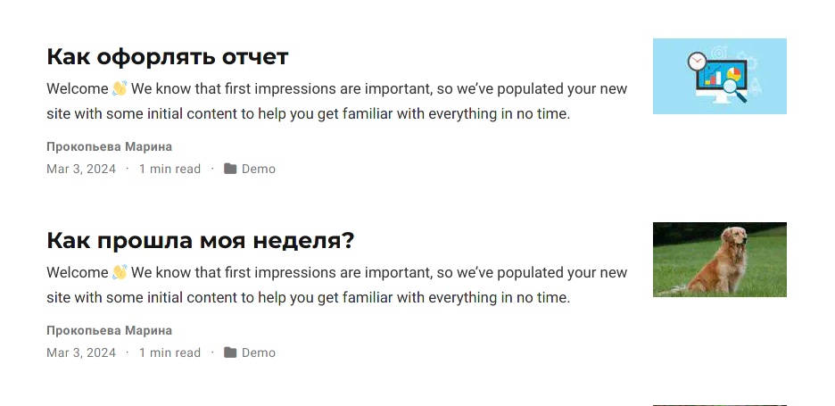

---
## Front matter
lang: ru-RU
title: Индивидуальный проект 
subtitle: 4 Этап 
author:
  - Прокопьева М. Е.
institute:
  - Российский университет дружбы народов, Москва, Россия

## i18n babel
babel-lang: russian
babel-otherlangs: english

## Formatting pdf
toc: false
toc-title: Содержание
slide_level: 2
aspectratio: 169
section-titles: true
theme: metropolis
header-includes:
 - \metroset{progressbar=frametitle,sectionpage=progressbar,numbering=fraction}
 - '\makeatletter'
 - '\beamer@ignorenonframefalse'
 - '\makeatother'
---

# Информация

## Докладчик

  * Прокопьева Марина Евгеньевна 
  * студент 
  * ФФМиЕН
  * Российский университет дружбы народов

# Вводная часть

# Цель работы

Добавить к сайту ссылки на научные и библиометрические ресурсы.

# Задание

    Зарегистрироваться на соответствующих ресурсах и разместить на них ссылки на сайте:
        eLibrary : https://elibrary.ru/;
        Google Scholar : https://scholar.google.com/;
        ORCID : https://orcid.org/;
        Mendeley : https://www.mendeley.com/;
        ResearchGate : https://www.researchgate.net/;
        Academia.edu : https://www.academia.edu/;
        arXiv : https://arxiv.org/;
        github : https://github.com/.
    Сделать пост по прошедшей неделе.
    Добавить пост на тему по выбору:
        Оформление отчёта.
        Создание презентаций.
        Работа с библиографией.

# Теоретическое введение

# Выполнение лабораторной работы

1. Регестрируюсь на сайтах 

{#fig:002 width=70%}

{#fig:003 width=70%}

# ФОТО

{#fig:004 width=70%}

{#fig:005 width=70%}

{#fig:006 width=70%}

# 2. Встасляю ссылки на мой сайт 

{#fig:001 width=70%}

{#fig:007 width=70%}

3. Делаю пост с новой темой как прошла неделя 

{#fig:008 width=70%}

# 4. Делаю пост на выбор как оформлять отчет 

{#fig:009 width=70%}

5. Итог

{#fig:010 width=70%}

# Выводы

Добавила к сайту ссылки на научные и библиометрические ресурсы.
