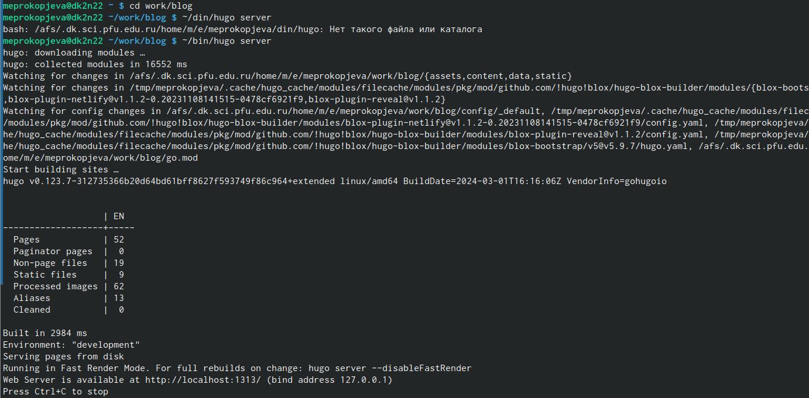
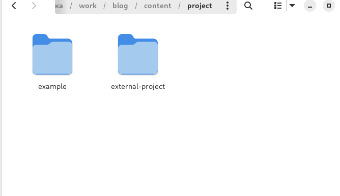
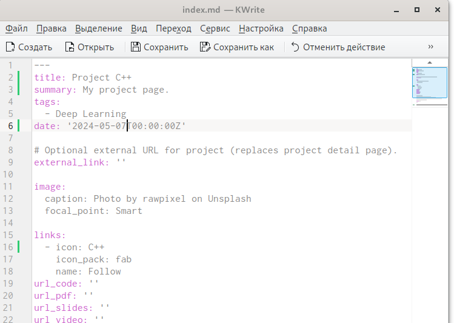
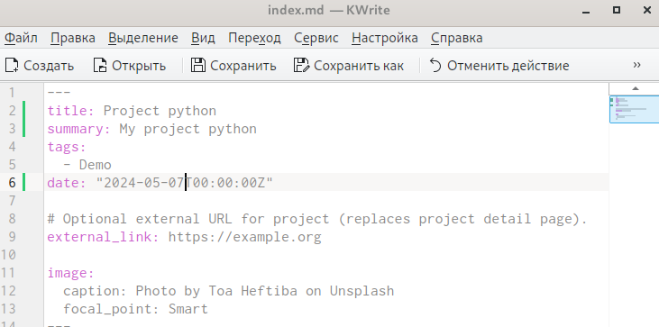
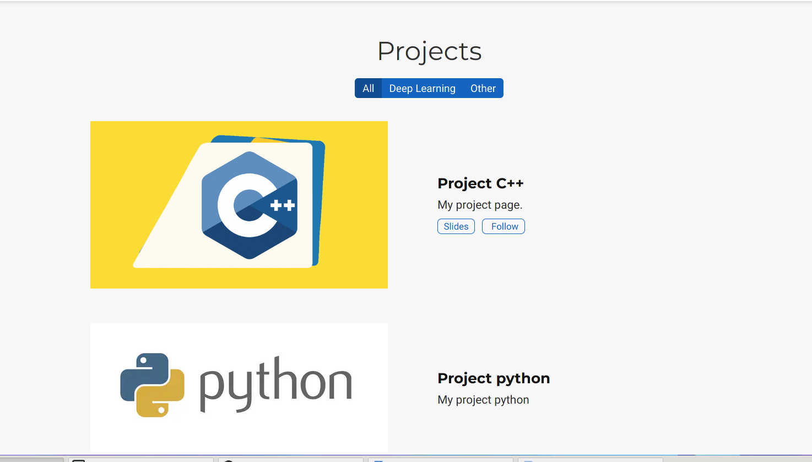
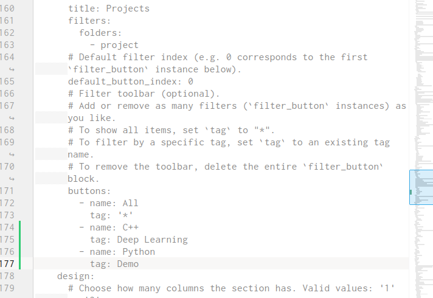
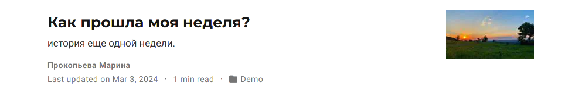
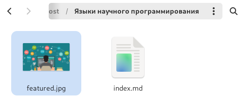
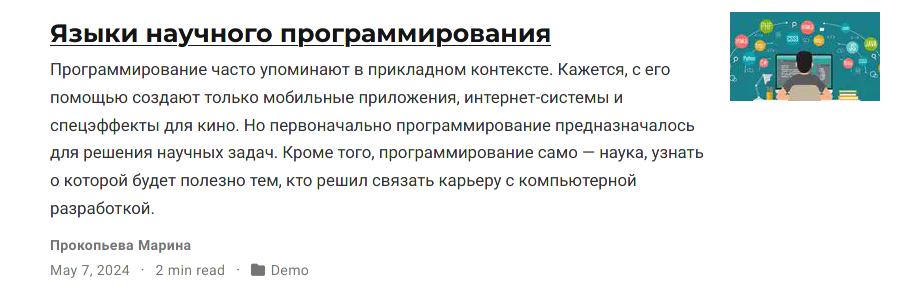

---
## Front matter
lang: ru-RU
title: Индивидуальный проект 
subtitle: 5 Этап
author:
  - прокопьева М. Е.
institute:
  - Российский университет дружбы народов, Москва, Россия

## i18n babel
babel-lang: russian
babel-otherlangs: english

## Formatting pdf
toc: false
toc-title: Содержание
slide_level: 2
aspectratio: 169
section-titles: true
theme: metropolis
header-includes:
 - \metroset{progressbar=frametitle,sectionpage=progressbar,numbering=fraction}
 - '\makeatletter'
 - '\beamer@ignorenonframefalse'
 - '\makeatother'
---

# Информация

## Докладчик

  * Прокопьева Марина Евгеньевна
  * студент 
  * ФФМиЕН
  * Российский университет дружбы народов

# Вводная часть
# Цель работы

Добавить с сайту все остальные элементы.

# Задание

    Сделать записи для персональных проектов.
    Сделать пост по прошедшей неделе.
    Добавить пост на тему по выбору.
     Языки научного программирования.
     

# Выполнение лабораторной работы

1. Заходим на сайт через консоль

{#fig:001 width=70%}

2. Входим в папку проектов 

{#fig:002 width=70%}

3. Редактируем наши проекты 

{#fig:003 width=70%}

{#fig:004 width=70%}

{#fig:005 width=70%}

{#fig:006 width=70%}

4. Делаем пост как прошла неделя

{#fig:007 width=70%}

5. Делаем пост на выбор - языки научного программирования

{#fig:008 width=70%}

{#fig:009 width=70%}

# Выводы

Добавиили к сайту все элементы 

